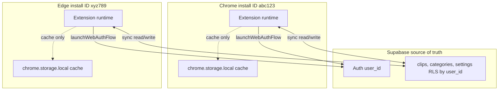

# Publishing Safety and Cross-Browser Data Parity

## Why this plan exists

PasteCraft will be published to both the **Chrome Web Store** and **Edge Add-ons**. The two stores assign different extension IDs, so the **only** bridge between a user's Chrome install and their Edge install is the Supabase cloud account. At the same time, every update you push can silently wipe `chrome.storage.local` data if the extension ID changes or if a storage schema shift is mishandled. This plan codifies the rules that prevent both.

## Current state (verified)

- `[extension/manifest.json](extension/manifest.json)` — production manifest, version `3.0.6`, no `"key"` field (correct). Contains a dead `oauth2` block that is not used by the current auth flow.
- `[manifest.json](manifest.json)` — root dev-loader manifest, loaded unpacked for development. Different paths, for dev only, never uploaded.
- Auth uses `supabase.auth.signInWithOAuth` + `chrome.identity.launchWebAuthFlow` with `chrome.identity.getRedirectURL()` (`[extension/supabase-client.js](extension/supabase-client.js)` lines 3484-3540). This is the correct cross-browser pattern.
- Offline write queue already implemented in `[extension/supabase-client.js](extension/supabase-client.js)` (`syncQueue` persisted to `chrome.storage.local`, `navigator.onLine` listeners, queue flush on reconnect at lines 8-11, 347-362, 390-444).
- `updated_at` columns and triggers exist on `clips`, `archived_clips`, `categories`, `settings` in `[db/supabase-schema.sql](db/supabase-schema.sql)`. LWW is schema-ready.

## How Chrome <-> Edge data sync works



Two independent `chrome.storage.local` silos per user, unified through Supabase by `user_id`. Last-write-wins by `updated_at`.

## Deliverables

### 1. New Cursor rule: `.cursor/rules/production-publishing-safety.mdc`

A single `alwaysApply: true` rule file with the following sections. Each section is a numbered set of non-negotiable rules, kept concise per the `[no-verbose.md](instructions/no-verbose.md)` convention.

**Section A - Identity preservation (never break extension ID)**
- `[extension/manifest.json](extension/manifest.json)` must never contain a `"key"` field in any uploaded package.
- Never create a new store listing for this extension on either Chrome Web Store or Edge Add-ons. Always "Upload new package" to the existing listing.
- Never change the Supabase project URL or anon key in a way that would change which project `user_id` values resolve against.
- Record the published Chrome extension ID and Edge extension ID in a locked reference section of the rule.

**Section B - Manifest version rules**
- `extension/manifest.json` `version` must strictly increase on every store upload.
- Patch bump for fixes, minor for additive features, major for breaking changes.
- Never reuse a version number that was ever submitted (even if rejected).
- Record last-published version so the agent can verify the bump before packaging.

**Section C - Permissions immutability**
- Never remove `"storage"`, `"identity"`, `"scripting"`, `"activeTab"`, `"clipboardWrite"`, `"tabs"`, or `"contextMenus"` from `extension/manifest.json` without a migration plan — removing any of these can orphan stored data or break auth.
- Never remove `host_permissions` entries for `*.supabase.co` or `accounts.google.com` — removing these silently breaks cloud sync and login.
- Adding new permissions is allowed but documented as a re-consent trigger in the release notes.

**Section D - Storage schema discipline**
- All `chrome.storage` keys must be defined as constants in one place (extend `[extension/tiered-storage.js](extension/tiered-storage.js)` conventions or a shared constants module).
- Never rename a key without a migration.
- Never delete a key without a migration that archives its data to cloud first.
- Every schema change bumps a `SCHEMA_VERSION` constant stored alongside the data.

**Section E - Migration guard (mandatory for any storage shape change)**
- `chrome.runtime.onInstalled` must listen for `reason === "update"` in `[extension/background.js](extension/background.js)`.
- A `migrations` object maps `fromSchemaVersion -> async migrationFn`.
- Migrations run sequentially, must be idempotent, and write the new `SCHEMA_VERSION` marker when complete.
- Migration failure falls back to cloud re-sync from Supabase, never wipes local data.

**Section F - Cross-browser sync rules (Chrome + Edge parity)**
- Source of truth is Supabase. `chrome.storage.local` is a cache, not storage of record.
- Writes must follow the tiered-storage + syncQueue pattern already in `[extension/supabase-client.js](extension/supabase-client.js)` — never bypass it.
- Conflict resolution = last-write-wins using `updated_at` on the server row. Client sends its `updated_at`; server accepts write only if client's `updated_at` is >= stored, else returns the newer row for the client to reconcile.
- On login, always hydrate from Supabase first, then merge local cache. Never push local-only state over fresher cloud state.
- Supabase Auth "Redirect URLs" must contain both `https://<CHROME_ID>.chromiumapp.org/` and `https://<EDGE_ID>.chromiumapp.org/`. Missing either = OAuth fails on that browser.
- Both stores must ship the same `extension/` zip. Never diverge code between Chrome and Edge builds.

**Section G - Pre-publish checklist (must pass before every upload)**
1. Verify `extension/manifest.json` `version` > last published.
2. Verify `extension/manifest.json` contains no `"key"` field.
3. Verify `"storage"`, `"identity"`, and all Supabase/Google `host_permissions` still present.
4. Load previous published unpacked, create test data (1 clip, 1 category, login, 1 settings change).
5. Replace with new version files, reload extension.
6. Verify: login persists, clips intact, settings intact, no console errors.
7. Repeat on both Chrome Stable and Edge Stable.
8. Diff check: if the diff since last published touches any re-test trigger area (Section I), full checklist is mandatory; otherwise lighter smoke test is acceptable.
9. Package = zip contents of `extension/` folder only (never the repo root, never the dev-loader `manifest.json`).

**Section H - Rollback plan**
- Keep the last 3 published `.zip` packages archived locally with filename `pastecraft-v<MAJOR>.<MINOR>.<PATCH>.zip`.
- If a published update breaks users, re-upload the previous working version with a higher version number.
- Document the incident in `[program-study/failure/FailureLog.md](program-study/failure/FailureLog.md)` per the project's `[log-format.md](instructions/log-format.md)` convention.

**Section I - Re-test triggers (any of these forces full Section G checklist)**
- Any edit to `extension/manifest.json`.
- Any edit to storage key names or storage shape.
- Any edit to `onInstalled` / `onStartup` in `[extension/background.js](extension/background.js)`.
- Any Supabase auth flow edit in `[extension/supabase-client.js](extension/supabase-client.js)`.
- Any Supabase table schema migration that touches `clips`, `archived_clips`, `categories`, `settings`, or `user_profiles`.
- Any change to `host_permissions` or `externally_connectable`.

**Section J - Store-specific notes**
- Chrome Web Store: review 1-7 days typical. Never pull the listing.
- Edge Add-ons: separate dashboard, same `extension/` zip. Edge review 1-5 days typical.
- Chrome OAuth: the Google Cloud Console OAuth client's "Authorized redirect URIs" must include the Supabase callback only; the extension callback is handled by `launchWebAuthFlow` hitting `https://<EXT_ID>.chromiumapp.org/`. Both Chrome and Edge extension IDs must be added to Supabase Auth redirect allowlist.

### 2. Migration guard in `[extension/background.js](extension/background.js)`

Add a minimal `chrome.runtime.onInstalled` handler that:

- Reads `SCHEMA_VERSION` from `chrome.storage.local`.
- If `reason === "install"`, sets `SCHEMA_VERSION` to the current version, no migration needed.
- If `reason === "update"` and `previousVersion` differs from current, runs any registered migrations in order. Initial registry will be empty; the scaffold exists so future versions have a safe path.
- Logs each step. On failure, does NOT wipe data — flags cloud re-sync instead.

Minimal scaffold shape:

```js
const SCHEMA_VERSION = 1;
const migrations = {};

chrome.runtime.onInstalled.addListener(async ({ reason, previousVersion }) => {
  if (reason === "install") {
    await chrome.storage.local.set({ __schemaVersion: SCHEMA_VERSION });
    return;
  }
  if (reason !== "update") return;
  try {
    const { __schemaVersion: from = 0 } = await chrome.storage.local.get("__schemaVersion");
    for (let v = from; v < SCHEMA_VERSION; v++) {
      if (migrations[v]) await migrations[v]();
    }
    await chrome.storage.local.set({ __schemaVersion: SCHEMA_VERSION });
  } catch (e) {
    console.error("[migration] failed, will fall back to cloud rehydrate on next login", e);
  }
});
```

### 3. Supabase redirect URL setup (documentation only)

Add a short "Cross-browser OAuth redirect URLs" section to `[docs/publishing/PUBLISHING_CHECKLIST.md](docs/publishing/PUBLISHING_CHECKLIST.md)` (or a new `docs/publishing/CROSS_BROWSER_AUTH.md`) that lists:
- How to find the Chrome extension ID and Edge extension ID on each store dashboard.
- Exact values to paste into Supabase Auth -> URL Configuration -> Redirect URLs.
- Reminder that this must be re-verified if either store ever re-issues an ID (should not happen, but worth the check).

### 4. Optional cleanup (not blocking)

The `oauth2` block in `[extension/manifest.json](extension/manifest.json)` is unused by the current `launchWebAuthFlow` + Supabase flow. Flag it as "safe to remove, revisit later" in the rule's notes section; do not remove in this plan to keep the change surface minimal.

## What is explicitly NOT in this plan

- No build tooling, no zip automation, no CI. Manual packaging continues.
- No schema changes. LWW is already supported by existing `updated_at` triggers.
- No changes to the existing offline syncQueue — it is validated as already correct.
- No changes to the root dev-loader `manifest.json`.

## Execution order (when plan is approved)

1. Create `.cursor/rules/production-publishing-safety.mdc` with Sections A-J.
2. Add `onInstalled` migration guard scaffold to `extension/background.js`.
3. Add cross-browser OAuth redirect URL doc snippet to publishing docs.
4. Manual verification: load unpacked, confirm migration log fires on update path.
5. Ask Ezequiel: "Is the implementation successful?" before logging to `SuccessLog.md` per project rule.
