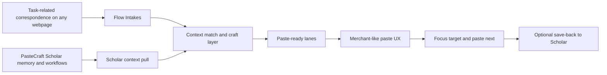

# PasteCraft Flow

> A Scholar-connected action layer that turns task context into paste-ready momentum on any webpage.

**Related:** `instructions/request.md` · `docs/merchant/MERCHANT-QUEUE-SYSTEM.md` · `docs/merchant/MERCHANT-ROADMAP-AND-TEST-LAB.md`

---

## Short vision

PasteCraft Flow makes PasteCraft feel alive while people work. Instead of hunting through clips, notes, tabs, and AI outputs, users stage the task in front of them and move through a guided paste loop that feels as smooth and useful as PasteCraft Merchant.

---

## What PasteCraft Flow is

- PasteCraft Flow is a **contextual paste layer** for arbitrary webpages.
- It reads the **task-related correspondence** around the user, then stages the most useful outputs as paste lanes.
- It mirrors Merchant's interaction rhythm: **stage → toggle lane → focus target → paste next**.
- It is not a separate archive. Scholar stays the memory system; Flow is the action surface.

---

## Relationship to PasteCraft Scholar

- **PasteCraft Scholar** remains the source of truth for clips, notes, saved context, and crafted AI outputs.
- Flow connects to Scholar's **database and workflows** so it can pull the right context for the active task instead of making the user search manually.
- Flow can use Scholar material to build focused reply sets, field-ready answers, summaries, follow-ups, and reusable snippets.
- Strong outputs can flow back into Scholar so the system keeps getting smarter and more reusable over time.

---

## Intakes

Intakes are the signals Flow uses to understand what the user is trying to do right now.

| Intake | What Flow can absorb |
|---|---|
| **Page context** | Visible text, field labels, page title, selection, copied thread fragments |
| **Scholar memory** | Clips, notes, saved references, prior crafted outputs, category context |
| **Task correspondence** | Emails, support tickets, job forms, DMs, comments, prompts, threaded discussions |
| **User intent** | A quick instruction such as "reply clearly", "fill faster", "summarize", or "follow up" |
| **Live craft context** | Recent Flow choices, skipped items, pinned items, and best-performing paste patterns |

---

## Insights

Insights are the helpful signals Flow produces after it understands the intake.

| Insight | Why it matters |
|---|---|
| **Context match** | Shows which Scholar assets best fit the current task |
| **Suggested lanes** | Breaks the task into clean paste flows like reply, fields, references, or follow-up |
| **Gap spotting** | Surfaces what is still missing before the user pastes |
| **Tone fit** | Helps outputs match the conversation, form, or page intent |
| **Reuse signal** | Highlights which crafted outputs are worth saving back into Scholar |

---

## Architecture

At a high level, Flow listens to what is happening on the page, pulls the most relevant Scholar context, then turns that context into a Merchant-style paste loop.

**Core feel:** the user stays in control, but the work feels lighter because PasteCraft keeps the next useful paste close at hand.

---

## Example use cases across webpages

- **Email and support portals:** turn a long thread into a reply lane, a resolution lane, and a follow-up lane.
- **Job and application pages:** stage resume facts, story answers, and tailored field responses without retyping the same ideas.
- **Research and study surfaces:** pull Scholar notes, summaries, and citations into LMS pages, docs, AI chats, and discussion boards.
- **CRM and admin tools:** move through status fields, handoff notes, contact replies, and reference snippets in sequence.
- **Community and social surfaces:** adapt one idea into a comment, DM, caption, FAQ response, or outreach message.

---

## Why this grows PasteCraft adoption

- It gives Scholar a **live job to do**, not just a place to store things.
- It brings the familiar Merchant paste-loop feeling into many more daily workflows.
- It encourages people to use PasteCraft more often as both a **pasting** tool and a **crafting** tool.
- It makes arbitrary webpages feel like valid PasteCraft workspaces, which increases repeat usage.
- It creates a strong loop: better saved knowledge in Scholar leads to better Flow outputs, and better Flow outputs motivate people to save more knowledge.

PasteCraft Flow turns PasteCraft from a memory bank into a daily action companion.
