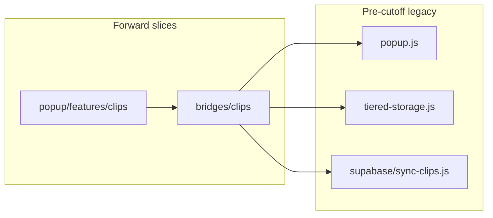

# Forward Architecture — Modular Vertical Slices + Legacy Facades

**Cutoff:** 2026-07-05. Code written or materially changed **after** this date follows this doc. Shippable legacy stays until touched.

**Named pattern:** **Modular Vertical Slices + Legacy Facades** (Arkitect: `modular-monolith` + `clean-slice-fusion` remix + `strangler-fig` migration + ACL at legacy seams).

---

## 1. Cutoff principle


| Rule           | Detail                                                                                       |
| -------------- | -------------------------------------------------------------------------------------------- |
| **Ship first** | No big-bang rewrite. Extension stays shippable.                                              |
| **New work**   | Vertical slices + thin entry wiring only.                                                    |
| **Legacy**     | Untouched files stay put. Migrate **only when you edit** that area.                          |
| **Bridges**    | New code talks to legacy through **one facade per domain** — never scattered legacy imports. |
| **Gates**      | CodeScene on changed files; Ezequiel SUCCESS before SuccessLog / task-branch commit.         |


---


## 2. Legacy vs new — ONE identification approach

**Primary signal: path convention.** Secondary: file header marker.

### Forward (new) paths — allowed for new logic


| Layer              | Path pattern                                                                  |
| ------------------ | ----------------------------------------------------------------------------- |
| Content slice      | `extension/content/<feature>/`                                                |
| Popup slice        | `extension/popup/features/<feature>/`                                         |
| Background slice   | `extension/background/handlers/<cluster>/`, `extension/background/messaging/` |
| Supabase slice     | `extension/supabase/<module>.js`                                              |
| Shared kernel      | `extension/shared/` (constants, messaging, IDs — no feature logic)            |
| **Legacy facades** | `extension/bridges/<domain>/`                                                 |


### Legacy (pre-cutoff) — do not add business logic here


| Path                                           | Role                                                                                     |
| ---------------------------------------------- | ---------------------------------------------------------------------------------------- |
| `extension/popup.js`                           | Popup shell (~1,705 lines)                                                               |
| `extension/content/quick-paste/quick-paste.js` | QuickPaste monolith (~2,500 lines)                                                       |
| Root shims                                     | `extension/background.js`, `extension/supabase-client.js`, `extension/content-script.js` |
| Ad-hoc roots                                   | `extension/tiered-storage.js`, `extension/indexeddb-store.js`, etc. until facaded        |


**Do not** create `extension/legacy/` or mass-move files. Legacy = **registry + path outside forward patterns**.

### Secondary marker (optional, on touch)

First line block when editing any file:

```js
/** @legacy-cutoff pre-2026-07-05 — migrate via extension/bridges/<domain>/ */
/** @forward-slice clips — canonical slice code */
```

Agents: if path is ambiguous, check marker; if neither, treat as legacy until facaded.

---


## 3. Target architecture (Arkitect-aligned)


| Arkitect ID               | Role in PasteCraft                                               |
| ------------------------- | ---------------------------------------------------------------- |
| **modular-monolith**      | Single MV3 deployable; strict internal module boundaries         |
| **vertical-slice**        | Feature folders own UI + orchestration in their context          |
| **strangler-fig**         | Replace legacy incrementally when touched                        |
| **anti-corruption-layer** | `extension/bridges/`* translates legacy shapes ↔ slice contracts |
| **clean-slice-fusion**    | Thin domain-facing APIs inside slices; adapters at edges         |


**Patterns (use, don't over-build):** Strategy (site adapters, sync providers), Facade + Adapter (bridges), Command + Mediator (background router, queues), Decorator (wrap legacy calls during migration).

**Deferred:** microservices, CQRS, event sourcing, DDD aggregates, abstract-factory ceremony.

---


## 4. Folder map — NEW work only

```
extension/
├── bridges/                    # NEW — legacy facades only (ACL)
│   ├── clips/
│   │   └── clips.legacy-facade.js
│   ├── sync/
│   │   └── sync.legacy-facade.js
│   └── quick-paste/
│       └── qp.legacy-facade.js
├── content/
│   └── <feature>/              # controller, constants, events, styles, adapters/
├── popup/
│   └── features/<feature>/     # controller, service, state, render, events
├── background/
│   ├── messaging/              # message-types.js, router.js
│   └── handlers/<cluster>/     # one cluster per message family
├── supabase/                   # one concern per module; thin supabase-client.js shim
└── shared/                     # storage keys, clip-id, messaging — no feature rules
```

**Context boundaries (MV3):**


| Context        | May import                                                | Must NOT                       |
| -------------- | --------------------------------------------------------- | ------------------------------ |
| Content script | `shared/`, own slice, `bridges/`                          | Popup modules, direct Supabase |
| Popup          | `shared/`, own slice, `bridges/`, `supabase/` via service | Content slices                 |
| Background     | `shared/`, handlers, `supabase/`                          | DOM, content UI                |
| Bridge         | Legacy modules + `shared/`                                | Sibling bridge internals       |


---


## 5. Bridge / facade rules

1. **One public module per domain** under `extension/bridges/<domain>/`.
2. **Slices import bridges — not legacy.** Example: `clips.service.js` → `bridges/clips/clips.legacy-facade.js` → `popup.js` / `tiered-storage.js` / `supabase/sync-clips.js`.
3. **Bridge owns translation:** legacy float IDs, tombstones, sync queue side effects, chrome.storage key quirks.
4. **No re-export sprawl:** facades export a small named API (≤10 functions per domain).
5. **Shrink over time:** as legacy is extracted into slices, facade delegates to slice code; delete legacy path last.
6. **Messages cross context:** use `message-types.js` + router — not ad-hoc `chrome.runtime.sendMessage` strings in slices.

**Facade sketch (doc only):**

```js
// extension/bridges/clips/clips.legacy-facade.js
export async function updateClipTitle(clipId, title) { /* wrap legacy + sync queue */ }
export async function deleteClip(clipId) { /* tombstone + sync; single exit */ }
```

---


## 6. Strangler migration — when you touch legacy




| Step | Action                                                                                          |
| ---- | ----------------------------------------------------------------------------------------------- |
| 1    | **Assess** — Arkitect `diagnose_repository` + `analyze_refactoring_opportunities` for the slice |
| 2    | **Facade first** — new behavior calls legacy through `bridges/<domain>/`                        |
| 3    | **Extract** — Move Method / Extract Class into slice folder (Arkitect: `moving-features`)       |
| 4    | **Rewire** — Entry shell + facade point at slice; legacy body shrinks                           |
| 5    | **Verify** — Smoke test + CodeScene; no storage key renames without migration                   |
| 6    | **Retire** — Remove legacy path only when facade has zero legacy imports                        |


**Extract-on-touch:** editing `popup.js` clip handlers → extract to `popup/features/clips/` or facade first, never grow the monolith.

---


## 7. What NOT to do

- Cross-slice imports (`merchant/` ↔ `widget/`).
- New business logic in `popup.js`, `quick-paste.js`, or root monoliths.
- Direct legacy imports from slice files (bypass bridge).
- Mass rename / `extension/legacy/` dump without migration plan.
- Storage key renames without `SCHEMA_VERSION` migration.
- Auto-refactor spaghetti without explicit migration intent (Arkitect policy).
- Singleton service layers for convenience.

---


## 8. First bridge targets (when touched)


| Priority | Slice          | Why                                                             | Facade domain                                                                          |
| -------- | -------------- | --------------------------------------------------------------- | -------------------------------------------------------------------------------------- |
| **1**    | **Clips CRUD** | Title update / delete bugs trace to scattered sync + legacy IDs | `bridges/clips/`                                                                       |
| **2**    | **Widget**     | Phase 0 slice done — pattern reference for content              | Already forward; extend, don't regress                                                 |
| **3**    | **Merchant**   | Adapters + queues already partial strangler                     | `merchant.adapters/` stays; add `bridges/merchant/` only if popup/sync legacy leaks in |


### Clips title update / delete → facade pattern


| Symptom                                 | Strangler fix                                                                                           |
| --------------------------------------- | ------------------------------------------------------------------------------------------------------- |
| Title save hits legacy path + sync race | `updateClipTitle()` in facade: normalize ID (`shared/clip-id.js`), single write path, queue one sync op |
| Delete resurrects on sync               | `deleteClip()` in facade: tombstone locally, enqueue delete, block legacy merge resurrect               |
| Popup + QuickPaste diverge              | Both call same facade API — not separate legacy copies                                                  |


---


## 9. Arkitect MCP — recommendations captured

**Diagnosis (2026-07-06, refreshed):**

- **Selected architecture:** `vertical-slice` — feature folders own delivery paths.
- **Remix:** `clean-slice-fusion` — Vertical Slice + Clean dependency direction.
- **Migration:** `strangler-fig` + `anti-corruption-layer` at `extension/bridges/`.
- **Action:** `guide-new-foundation` — **auto-refactor: false**.
- **Patterns (top):** Strategy, Decorator, Adapter, Command, Facade; Mediator at background router when needed.
- **Tags:** `vertical-slice-delivery`, `legacy-strangler`, `design-tokens`, `strangler-fig`, `crud`, `plugin-system`.
- **Cursor rules:** `.cursor/rules/arkitect-mcp-paved-route.mdc`, `forward-architecture.mdc`, `premium-ui-phases.mdc`.

**Relation to existing docs:**


| Doc                               | Role                                                           |
| --------------------------------- | -------------------------------------------------------------- |
| This file                         | **Canonical cutoff + bridge strategy**                         |
| `arkitect-mcp-paved-route.mdc`    | **Mandatory** MCP workflow before every implementation         |
| `forward-architecture.mdc`        | Always-on cutoff + Arkitect complement (this doc summarized)   |
| `premium-ui-phases.mdc`           | Phased CSS/token UI vertical slices                            |
| `vertical-slice-modularity.mdc`   | Implementation detail for slice layout                         |
| `refactor-plan-composer-first.md` | Phased execution roadmap (MV3-B, Supabase 2.x, QuickPaste 3.x) |
| `architecture-reference.mdc`      | MV3 data flow + component responsibilities                     |


---


## 10. Re-run Arkitect for new features

**Per feature slice (before coding):**

```yaml
# MCP intake — paste into agent or apply_workbench_intake
repoPath: c:\Dev\PasteCraft
requestedOutcome: "Implement [FEATURE] ONLY in forward paths. Legacy via extension/bridges/[domain]/. DO NOT edit: [forbidden paths]."
explicitRefactorIntent: true
category: moving-features
architectureId: vertical-slice
remixId: clean-slice-fusion
requirementTags: [vertical-slice-delivery, legacy-strangler, mv3-extension]
```

**Tools (in order):**

1. `diagnose_repository` — confirm architecture path
2. `recommend_patterns` — pattern shortlist for the feature
3. `analyze_refactoring_opportunities` — if touching legacy registry files

**Arkitect Desktop (optional):** `apply_workbench_intake` with `autoRun.diagnosis: true` when Desktop bridge is running — saves preset `pastecraft-forward-<feature>`.

**Manual each feature?** **Yes for structural work** (new slice, legacy touch, bridge). **No** for trivial bugfix wholly inside an existing forward slice file.

---


## 11. Agent checklist (every implementation)

1. Confirm date > cutoff → forward paths only.
2. Pick slice folder OR bridge domain before coding.
3. Legacy needed? → add/extend `extension/bridges/<domain>/` — no direct legacy import from slice.
4. Register message types in `message-types.js` if cross-context.
5. CodeScene review on touched files.
6. Ask Ezequiel: *Is the implementation successful?* before SuccessLog.

