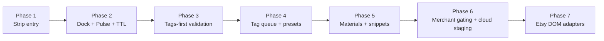
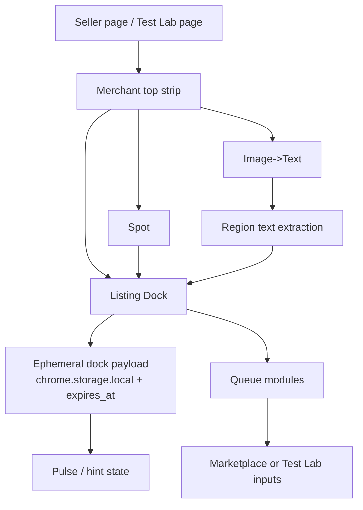

# PasteCraft Merchant - Phase Status

**Related:** `MERCHANT-ONE-SHOT-PASTE-PHASES.md` · `MERCHANT-SOCIAL-MEDIA-PRIORITY.md`

## Snapshot
- Merchant is a seller-service layer inside the extension, centered on the top strip, Listing Dock, and queue flow.
- Current code reaches the end of the local/manual workflow: Phases 1-5 are present in `extension/content/merchant/`.
- The next real gap is not more queue scaffolding; it is Phase 6 gating/cloud staging and Phase 7 real marketplace adapters.

## Done Now
| Slice | Evidence | Status |
|---|---|---|
| Strip shell + mount | `merchant.controller.js`, `merchant.top-strip.js`, `merchant.events.js` | Mounted content layer with Spot, Image->Text, queues, snippets, and dock |
| Ephemeral staging | `merchant.dock-storage.js`, `merchant.pulse.js`, `merchant.listing-dock.js` | Local `chrome.storage` payload with `expires_at`, Pulse live/expiring states |
| Tags-first core | `merchant.tags.js`, `merchant.tag-queue.js`, `merchant.listing-dock.js` | Etsy-style validation, dedupe, preview chips, copy-all, paste-next flow |
| Import/staging helpers | `merchant.spot.js`, `merchant.image-to-text.js` | Selection capture and region-based text staging into dock targets |
| Phase 5 seller helpers | `merchant.materials.js`, `merchant.material-queue.js`, `merchant.snippets.js` | Materials normalization/copy and reusable seller snippets are live |
| Test Lab | `merchant-test-lab/`, `website/public/merchant-test/`, `website/src/pages/merchant-test/index.astro` | Local + website mock pages for Etsy, Printify, Amazon, Shopify, social promo, and more |
| Shared queue engine | `merchant.queue-factory.js`, `merchant.title-queue.js`, `merchant.description-queue.js`, `merchant.keyword-queue.js`, `merchant.bullet-queue.js`, `merchant.hashtag-queue.js` | Advanced queue scaffolding already exists beyond the core tag/material flow |

## Almost Done / Next Needed
- **Phase 6 gating is still missing.** `merchant.controller.js` explicitly says billing/gating is deferred, and the strip currently defaults to enabled for testing.
- **Cloud staging sync is only prepped, not wired.** `merchant.constants.js` and `merchant.dock-storage.js` define the future `merchant_listing_staging` shape, but the current flow stays local-only.
- **Adapters are the next big milestone.** The roadmap calls for `merchant.adapters/`, but no adapter files currently exist under `extension/content/merchant/`.
- **Image->Text is closer to region text extraction than full OCR.** `merchant.region-text.js` currently pulls visible DOM text plus `alt` / `data-ocr-text` metadata.
- **Some roadmap prefs are not yet live.** `tagsOnlyMode` exists in defaults, but it is not consumed by the current merchant files; delimiter/export prefs are also not wired beyond comma-joined storage/copy.
- **Advanced queues exist, but they still need phase-level validation.** Title, description, keyword, bullet, and hashtag queues are mounted already, yet the documented core QA still centers on tags, materials, and snippets.

## Current Phase Flow
1. `merchant.controller.js` mounts the strip and dock on page load when the merchant strip is enabled.
2. Seller stages content via selection, clipboard, or Image->Text into the Listing Dock.
3. `merchant.dock-storage.js` normalizes fields and saves ephemeral staging with TTL.
4. `merchant.pulse.js` and `merchant.queue-hints.js` reflect live state back to the strip.
5. Queue toggles move staged values into matching marketplace or Test Lab fields one-by-one.
6. The next phase boundary is moving from **manual assist tooling** into **gated + adapter-driven autofill**.

## Recommended Next Actions
- [ ] Wire Phase 6 `has_merchant` gating before treating the strip as production-ready.
- [ ] Add the first real adapter slice under `merchant.adapters/` — see `MERCHANT-ONE-SHOT-PASTE-PHASES.md` Phase 1 (Etsy/Redbubble/TeePublic/Printify/Generic test lab).
- [ ] Wire `ONE_SHOT_PASTE` strip action per one-shot phase plan (all seven queue types in scope).
- [ ] Either wire `tagsOnlyMode` and delimiter/export prefs, or trim them from the roadmap until they ship.
- [ ] Upgrade Image->Text from DOM-region extraction to the intended OCR/fallback flow.
