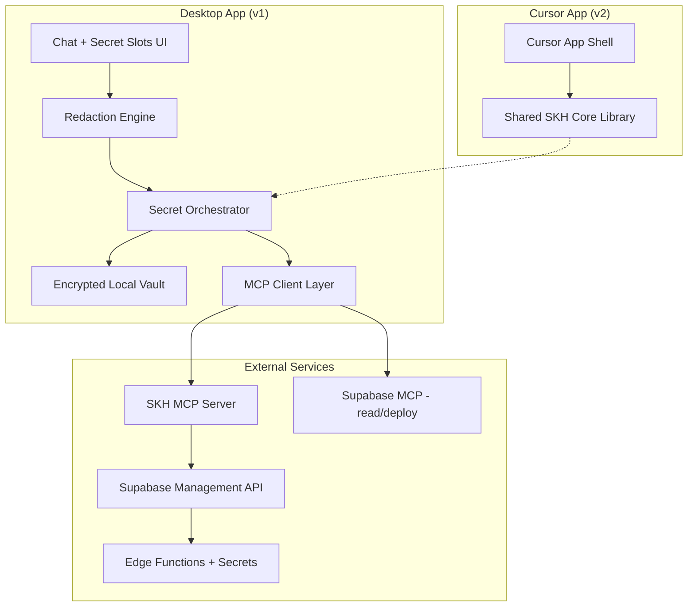
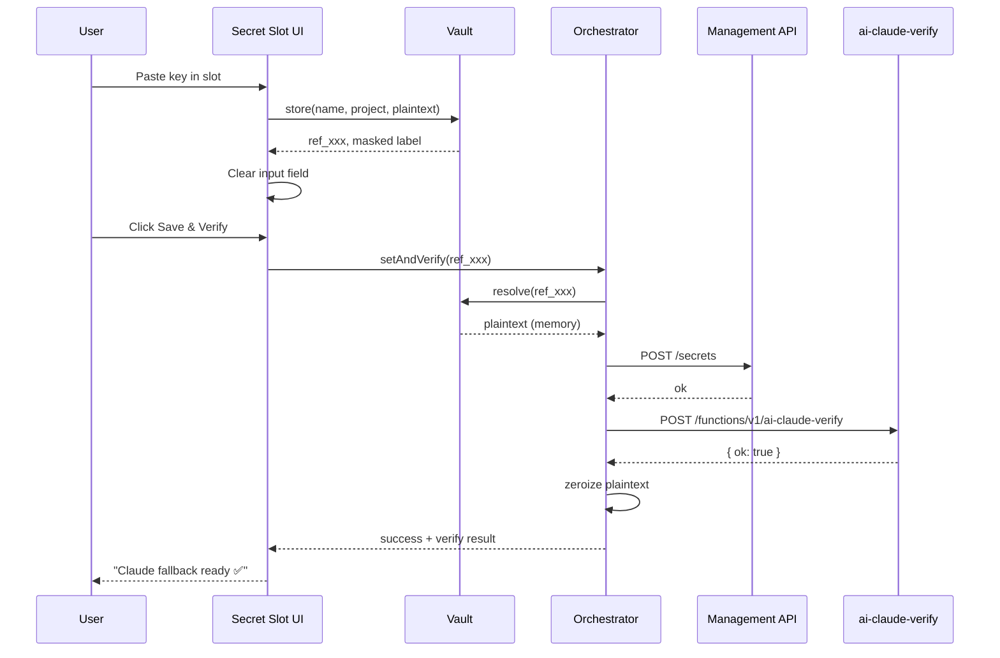
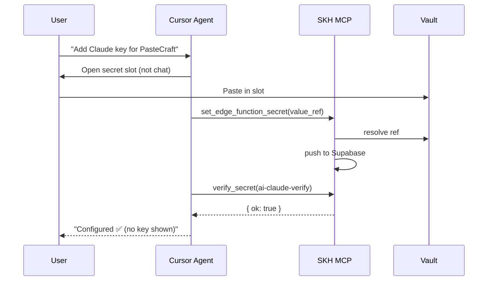

# Secret Key Handler — Desktop Architecture

**Product:** Secret Key Handler (SKH)  
**Platform:** Desktop (v1) → Cursor App (v2)  
**Purpose:** Safely add, rotate, and verify Supabase Edge Function secrets without exposing plaintext keys in chat, logs, or history.  
**Status:** Architecture export — pre-implementation  
**Last updated:** 2026-05-22

---

## 1. Executive Summary

SKH is a **desktop-first secret orchestration app** that sits between the user (and future Cursor agents) and **Supabase Edge Function secrets**. Users paste API keys into protected inputs — never into normal chat text. The app encrypts secrets locally, pushes them to Supabase via a controlled bridge, and stores **redacted chat history** that references secrets by opaque IDs only.

**Core promise:** Configure secrets through conversation-style UX without ever persisting or displaying plaintext keys after submit.

**Near-term roadmap:**

| Phase | Platform | Deliverable |
|---|---|---|
| v1 | Desktop (Electron or Tauri) | Local vault + Supabase secret push + verify |
| v2 | Cursor App | Same engine embedded in Cursor; MCP-native |
| v3 | Team vault | Shared projects, rotation, audit (optional) |

---

## 2. Problem Statement

### 2.1 Current pain

- Supabase MCP exposes `deploy_edge_function`, `list_edge_functions`, `get_logs` — **no `set_secret` tool**.
- Users paste keys into Cursor chat → keys appear in transcripts, tool args, screenshots, and agent context.
- Supabase Management API returns **SHA-256 digests only** on read (good) but setup still requires manual Dashboard or CLI.
- PasteCraft needs server-side keys (`ANTHROPIC_API_KEY`, `OPENAI_API_KEY`, etc.) that must **never** ship in the extension bundle.

### 2.2 Goals

1. **Zero plaintext in chat history** after submit.
2. **Zero plaintext in MCP tool arguments** (use refs only).
3. **Local encrypted vault** with OS-backed master key.
4. **One-click verify** after secret push (e.g. `ai-claude-verify`).
5. **Desktop-native** UX: keychain, clipboard control, offline vault access.
6. **Cursor App ready** — same core library, different shell.

### 2.3 Non-goals (v1)

- Storing secrets in Supabase Postgres.
- “Show me my key again” — rotate/replace only.
- Multi-user team vault with shared decryption.
- Browser extension secret handler.

---

## 3. System Architecture



### 3.1 Layer responsibilities

| Layer | Responsibility |
|---|---|
| **UI** | Secret slots, project picker, masked chat, verify status |
| **Redaction Engine** | Strip/detect secrets before any persistence |
| **Vault** | Encrypt/decrypt at rest; OS keychain for master key |
| **Orchestrator** | set → verify → audit log (actions only) |
| **MCP Client** | Talk to SKH MCP + Supabase MCP without leaking values |
| **SKH MCP Server** | `set_edge_function_secret`, `list_secret_names`, `verify_secret` |

---

## 4. Desktop App Architecture

### 4.1 Recommended stack

| Choice | Option A (recommended) | Option B |
|---|---|---|
| Shell | **Tauri 2** (Rust + WebView) | Electron |
| UI | React or vanilla + CSS tokens | Same |
| Vault crypto | `@noble/ciphers` (AES-256-GCM) + OS keychain | libsodium |
| MCP transport | stdio MCP server (Node sidecar) | HTTP localhost |
| Supabase auth | Personal Access Token in keychain | OAuth (v2) |

**Why Tauri for desktop:** smaller binary, native keychain APIs, better clipboard isolation, easier path to Cursor App (shared TS core).

### 4.2 Process model

```
┌─────────────────────────────────────────────┐
│  SKH Desktop (main)                          │
│  ├─ Renderer: UI (secret slots, chat, history)│
│  ├─ Core: orchestrator + vault (shared lib)   │
│  └─ Sidecar: skh-mcp-server (stdio)           │
└─────────────────────────────────────────────┘
         │                          │
         ▼                          ▼
   OS Keychain              Supabase Management API
   ~/.skh/vault.enc         (secrets push)
```

### 4.3 Desktop folder layout (planned)

```
secret-key-handler/
├── apps/
│   └── desktop/                 # Tauri/Electron shell
│       ├── src/
│       │   ├── ui/              # Chat, secret slots, history
│       │   └── main/            # IPC, keychain, sidecar spawn
│       └── tauri.conf.json
├── packages/
│   ├── skh-core/                # Orchestrator, redactor, vault — shared w/ Cursor App
│   ├── skh-mcp-server/          # Custom MCP tools for secrets
│   └── skh-supabase/            # Management API client
├── docs/
│   └── secret-key-handler-desktop-architecture.md  # this file
└── package.json                 # monorepo root
```

---

## 5. Security Model

### 5.1 Trust boundaries

```
[User paste] → [Memory only] → [Encrypt] → [Vault file]
                    ↓
              [Mgmt API push] → [Supabase secrets store]
                    ↓
              [Memory zeroized]
```

**Plaintext exists only:**

1. In password input field while user types (optional reveal toggle).
2. In memory during encrypt + push (≤ few seconds).
3. Never on disk unencrypted.
4. Never in chat JSON, MCP logs, or analytics.

### 5.2 Encryption design

| Item | Algorithm / store |
|---|---|
| Master key | OS keychain (DPAPI / Keychain / Secret Service) |
| Vault file | AES-256-GCM, random 12-byte nonce per entry |
| Key derivation | Argon2id from optional user PIN (v1.1) |
| Secret refs | `ref_<uuid>` — opaque, no embedded metadata |

**Vault entry shape (encrypted blob decodes to):**

```json
{
  "ref": "ref_8f3a2b1c",
  "name": "ANTHROPIC_API_KEY",
  "project_ref": "blpngeeqcegquiydreyu",
  "ciphertext": "<base64>",
  "created_at": "2026-05-22T19:00:00Z",
  "last_rotated_at": null,
  "fingerprint_last4": "abcd"
}
```

Chat/history stores **`ref` + `name` + `fingerprint_last4` only** — never `ciphertext` in display layer.

### 5.3 Redaction rules

Apply **before** any write to chat history, disk, or MCP:

| Pattern | Example | Replacement |
|---|---|---|
| Anthropic | `sk-ant-...` | `[[SECRET:anthropic:ref_xxx]]` |
| OpenAI | `sk-...` | `[[SECRET:openai:ref_xxx]]` |
| Stripe | `sk_live_...`, `whsec_...` | `[[SECRET:stripe:ref_xxx]]` |
| Resend | `re_...` | `[[SECRET:resend:ref_xxx]]` |
| Generic high-entropy | 32+ char alphanumeric | `[[SECRET:generic:ref_xxx]]` |

Display layer renders placeholders as: `ANTHROPIC_API_KEY ••••••abcd`

### 5.4 MCP safety contract

**Forbidden in MCP tool arguments:**

```json
{ "name": "ANTHROPIC_API_KEY", "value": "sk-ant-api03-..." }
```

**Required pattern:**

```json
{ "name": "ANTHROPIC_API_KEY", "value_ref": "ref_8f3a2b1c", "project_ref": "blpngeeqcegquiydreyu" }
```

SKH MCP server resolves `value_ref` inside the desktop process, calls Management API, zeroizes buffer.

### 5.5 Threat matrix

| Threat | Mitigation |
|---|---|
| Key in chat transcript | Dedicated secret slots; redaction engine |
| Key in MCP logs | Ref-only tool args |
| Key in history replay | Store refs + masked labels |
| Key on disk | AES-256-GCM vault + OS keychain |
| Screenshot leak | Never render full value; blur-by-default |
| Wrong project push | Project picker + confirm modal |
| Reserved prefix (`SUPABASE_*`) | Block at validation (Supabase rejects these) |
| Clipboard sniffing | Clear clipboard after paste option; auto-clear timer |
| Shared machine | Optional PIN unlock for vault |

---

## 6. Supabase Integration

### 6.1 What Supabase MCP provides today

| Tool | Use in SKH |
|---|---|
| `list_projects` | Project picker |
| `list_edge_functions` | Confirm deploy targets |
| `deploy_edge_function` | Deploy verify functions |
| `get_logs` | Post-push verification debugging |
| `get_project_url` | Build verify URLs |

**Gap:** no secret management → **SKH MCP server fills this**.

### 6.2 Secret push paths (v1 → v2)

| Method | v1 Desktop | v2+ |
|---|---|---|
| CLI wrapper | `supabase secrets set NAME=VALUE --project-ref X` | Fallback |
| Management API | `POST /v1/projects/{ref}/secrets` | Primary |
| Terraform | — | CI/CD only |

**Management API notes:**

- Read returns **SHA-256 digests only** — cannot recover plaintext (by design).
- Names must **not** start with `SUPABASE_` (reserved).
- After set, edge functions pick up secrets on next cold start.

### 6.3 Verify flow (PasteCraft example)

```
1. User sets ANTHROPIC_API_KEY via secret slot
2. SKH pushes to Supabase
3. SKH calls POST /functions/v1/ai-claude-verify
4. Response: { ok, configured, reachable, model }
5. Chat shows: "Claude fallback ready ✅" (no key)
```

### 6.4 PasteCraft secret catalog

| Secret name | Used by | Client-safe? |
|---|---|---|
| `ANTHROPIC_API_KEY` | `ai_workflow.ts` Claude fallback | Never in extension |
| `OPENAI_API_KEY` | AI edge functions | Never in extension |
| `GOOGLE_AI_KEY` | Gemini workflow | Never in extension |
| `STRIPE_SECRET_KEY` | Stripe webhook, checkout | Never in extension |
| `STRIPE_WEBHOOK_SECRET` | `stripe-webhook` | Never in extension |
| `RESEND_API_KEY` | Email edge functions | Never in extension |
| `SUPABASE_URL` | Auto-injected by Supabase | Public OK |
| `SUPABASE_ANON_KEY` | Extension config | Public OK |

---

## 7. SKH MCP Server — Tool Schema

Custom MCP server: `skh-mcp-server` (stdio, spawned by desktop app).

### 7.1 Tools

#### `list_secret_names`

Returns configured secret **names** and digests — no values.

```json
{
  "project_ref": "blpngeeqcegquiydreyu"
}
```

Response:

```json
{
  "secrets": [
    { "name": "ANTHROPIC_API_KEY", "digest": "sha256:...", "configured": true }
  ]
}
```

#### `set_edge_function_secret`

```json
{
  "project_ref": "blpngeeqcegquiydreyu",
  "name": "ANTHROPIC_API_KEY",
  "value_ref": "ref_8f3a2b1c"
}
```

Response:

```json
{
  "ok": true,
  "name": "ANTHROPIC_API_KEY",
  "fingerprint_last4": "abcd",
  "pushed_at": "2026-05-22T19:00:00Z"
}
```

#### `verify_secret`

```json
{
  "project_ref": "blpngeeqcegquiydreyu",
  "verify_function": "ai-claude-verify"
}
```

#### `rotate_secret`

Replace existing secret; old value never shown.

```json
{
  "project_ref": "blpngeeqcegquiydreyu",
  "name": "ANTHROPIC_API_KEY",
  "value_ref": "ref_new_uuid"
}
```

### 7.2 Auth

- Supabase **Personal Access Token** stored in OS keychain (`skh.supabase.pat`).
- Never passed through chat or MCP tool args from Cursor — desktop resolves locally.

---

## 8. UI Architecture (Desktop)

### 8.1 Main views

| View | Purpose |
|---|---|
| **Projects** | Linked Supabase projects |
| **Secrets** | Per-project secret slots |
| **Chat** | Intent-driven actions with redacted history |
| **Activity** | Audit log (actions only, no values) |
| **Settings** | Keychain, auto-clear clipboard, MCP config |

### 8.2 Secret slot component

```
┌──────────────────────────────────────────────┐
│ ANTHROPIC_API_KEY                    PasteCraft │
│ ┌──────────────────────────────────────────┐ │
│ │ ••••••••••••••••••••••••••••••••   👁 ⏱ │ │
│ └──────────────────────────────────────────┘ │
│ [ ] Hide after paste    [ ] Clear clipboard   │
│                              [ Save & Verify ]│
└──────────────────────────────────────────────┘
```

**Behaviors:**

- Password input by default.
- Reveal toggle: show 3 seconds, then re-mask.
- After Save: field clears immediately; UI shows `••••abcd`.
- Optional: block copy from field after submit.

### 8.3 Chat message model

**User sends (display layer):**

> Add Claude API key for PasteCraft and verify fallback

**User action (secret slot, not chat text):**

> `[SECRET_SLOT: ANTHROPIC_API_KEY → ref_8f3a2b1c]`

**Stored history entry:**

```json
{
  "id": "msg_001",
  "role": "user",
  "display": "Add Claude API key for PasteCraft and verify fallback",
  "attachments": [
    { "type": "secret_ref", "name": "ANTHROPIC_API_KEY", "ref": "ref_8f3a2b1c", "masked": "••••abcd" }
  ],
  "timestamp": "2026-05-22T19:00:00Z"
}
```

**Assistant response:**

```json
{
  "id": "msg_002",
  "role": "assistant",
  "display": "ANTHROPIC_API_KEY set for PasteCraft. Claude fallback verified ✅ (claude-3-5-haiku-latest).",
  "actions": [
    { "type": "secret.set", "name": "ANTHROPIC_API_KEY", "status": "success" },
    { "type": "verify", "function": "ai-claude-verify", "ok": true }
  ]
}
```

---

## 9. Data Storage

### 9.1 Local paths (desktop)

| Path | Contents |
|---|---|
| `~/.skh/vault.enc` | Encrypted secret entries |
| `~/.skh/history/` | Redacted chat sessions (JSONL) |
| `~/.skh/projects.json` | Project refs + labels (no secrets) |
| `~/.skh/audit.log` | Action audit (no values) |

### 9.2 OS keychain entries

| Key | Value |
|---|---|
| `skh.master.wrapped` | Wrapped vault master key |
| `skh.supabase.pat` | Supabase PAT for Management API |
| `skh.pin.salt` | Optional PIN salt (v1.1) |

### 9.3 What never gets stored

- Plaintext API keys on disk.
- Full keys in chat history.
- Keys in MCP server logs.
- Keys in error reports / crash dumps (scrub before send).

---

## 10. Core Library API (`skh-core`)

Shared between Desktop and future Cursor App.

```typescript
// packages/skh-core/src/index.ts

export interface SecretRef {
  ref: string;
  name: string;
  projectRef: string;
  fingerprintLast4: string;
}

export interface Vault {
  store(name: string, projectRef: string, plaintext: string): Promise<SecretRef>;
  resolve(ref: string): Promise<string>; // memory only; caller must zeroize
  rotate(ref: string, newPlaintext: string): Promise<SecretRef>;
  list(projectRef: string): Promise<SecretRef[]>;
}

export interface Redactor {
  redact(text: string): { text: string; refs: SecretRef[] };
  mask(value: string): string; // ••••last4
}

export interface SecretOrchestrator {
  setAndVerify(input: {
    projectRef: string;
    name: string;
    valueRef: string;
    verifyFunction?: string;
  }): Promise<{ pushed: boolean; verified: boolean; detail: string }>;
}

export interface HistoryStore {
  append(sessionId: string, entry: HistoryEntry): Promise<void>;
  list(sessionId: string): Promise<HistoryEntry[]>;
}
```

---

## 11. Cursor App Migration Path (v2)

When SKH becomes a Cursor App:

| Desktop component | Cursor App equivalent |
|---|---|
| Tauri shell | Cursor App host / webview |
| `skh-core` | Same package, imported directly |
| Sidecar MCP server | Registered MCP in Cursor config |
| OS keychain | Cursor secure storage APIs (when available) or same keychain |
| Chat UI | Cursor-native panel or embedded view |

**Integration pattern:**

1. User: “Add Anthropic key for PasteCraft”
2. Cursor agent opens SKH secret slot (not chat text input).
3. Agent calls `set_edge_function_secret` with `value_ref`.
4. Agent calls `verify_secret`.
5. Agent responds with status only.

**Cursor App manifest (planned):**

```json
{
  "name": "secret-key-handler",
  "mcpServers": {
    "skh": {
      "command": "node",
      "args": ["./packages/skh-mcp-server/dist/index.js"]
    }
  }
}
```

---

## 12. MVP Phases

### Phase 1 — Desktop foundation (2 weeks)

- [ ] Tauri shell + secret slot UI
- [ ] OS keychain + encrypted vault
- [ ] CLI bridge: `supabase secrets set`
- [ ] Redacted chat history
- [ ] PasteCraft project preset + `ai-claude-verify` ping

### Phase 2 — MCP + Management API (1–2 weeks)

- [ ] `skh-mcp-server` with ref-based tools
- [ ] Management API direct push
- [ ] `list_secret_names` (digests only)
- [ ] Activity audit log

### Phase 3 — Cursor App (2 weeks)

- [ ] Extract `skh-core` to shared package
- [ ] Cursor App shell
- [ ] Agent workflow: intent → slot → verify
- [ ] Document in Cursor marketplace listing

### Phase 4 — Team (optional)

- [ ] Envelope encryption for shared vault
- [ ] Rotation reminders
- [ ] RBAC per project

---

## 13. Implementation Constraints

### 13.1 Hard rules

1. **Never** expose secret values in extension/client bundles (PasteCraft rule).
2. **Never** use `SUPABASE_` prefix for custom secrets.
3. **Never** log request bodies containing secret values.
4. **Always** confirm project before push.
5. **Always** verify after push when a verify function exists.
6. **Rotate, don't reveal** — no “show my key” feature.

### 13.2 Validation

```typescript
const RESERVED_PREFIXES = ['SUPABASE_'];
const ALLOWED_SECRETS = [
  'ANTHROPIC_API_KEY',
  'OPENAI_API_KEY',
  'GOOGLE_AI_KEY',
  'STRIPE_SECRET_KEY',
  'STRIPE_WEBHOOK_SECRET',
  'RESEND_API_KEY',
  'MGMT_API_TOKEN',
  'PROJECT_REF',
];

function validateSecretName(name: string): boolean {
  if (RESERVED_PREFIXES.some(p => name.startsWith(p))) return false;
  return /^[A-Z][A-Z0-9_]{2,63}$/.test(name);
}
```

---

## 14. Sequence Diagrams

### 14.1 Set secret (desktop)



### 14.2 Cursor agent flow (v2)



---

## 15. Open Questions

| # | Question | Default assumption |
|---|---|---|
| 1 | Tauri vs Electron? | Tauri |
| 2 | Monorepo inside PasteCraft or separate repo? | Separate repo, PasteCraft as first consumer |
| 3 | PAT vs OAuth for Supabase? | PAT in keychain for v1 |
| 4 | Support non-Supabase secret stores later? | Yes — vault abstraction allows Vercel/Netlify adapters |
| 5 | PIN required on launch? | Optional, off by default |

---

## 16. References

- [Supabase MCP Server](https://supabase.com/docs/guides/ai-tools/mcp)
- [Supabase Edge Function Secrets](https://supabase.com/docs/guides/functions/secrets)
- [Terraform: supabase_edge_function_secrets](https://registry.terraform.io/providers/supabase/supabase/latest/docs/resources/edge_function_secrets)
- PasteCraft: `supabase/functions/_shared/ai_workflow.ts` — Claude fallback
- PasteCraft: `supabase/functions/ai-claude-verify/` — verify endpoint
- PasteCraft: `extension/config.js` — client never holds AI secrets

---

## 17. Export Checklist

Use this doc when starting the Cursor App or desktop repo:

- [ ] Copy `packages/skh-core` interface from Section 10
- [ ] Implement vault per Section 5.2
- [ ] Implement MCP tools per Section 7
- [ ] Build secret slot UI per Section 8.2
- [ ] Wire PasteCraft verify flow per Section 6.3
- [ ] Follow hard rules in Section 13.1

---

*Document owner: PasteCraft / SKH initiative*  
*Next step: scaffold `secret-key-handler/` monorepo with Tauri desktop shell*
