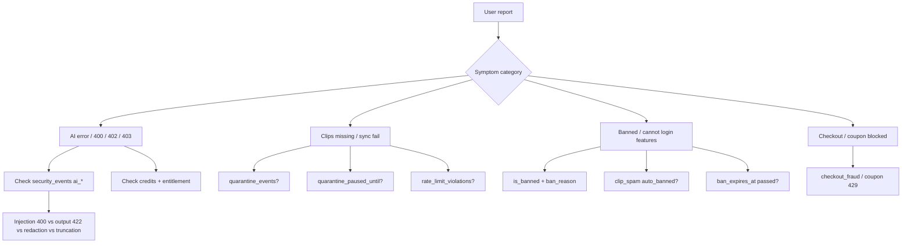

# PasteCraft Security Operations Reference

**Purpose:** Single source of truth for every security control, limit, authorization level, and logged event. Use this when user volume grows and something feels wrong — compare **expected behavior** here vs **what you see** in Supabase, emails, or the extension.

**Last synced:** 2026-05-26 (production project `blpngeeqcegquiydreyu`)

**Code applied in repo (2026-05-26):** AI input guard (all AI routes) + AI output guard (moderation, redaction, leak strip). Redeploy Edge Functions to activate in production.

**Related docs:**
- [Security workflow (how layers fit)](pastecraft-security-workflow.md)
- [Apply hardening migrations](APPLY-SECURITY-HARDENING.md)
- [RLS audit snapshot](security-rls-audit-2026-05-26.md)

---

## Table of contents

1. [Authorization levels](#1-authorization-levels)
2. [AI risk model and current level](#2-ai-risk-model-and-current-level)
3. [AI input guard (all adjustments)](#3-ai-input-guard-all-adjustments)
   - [3.5 AI output guard (applied)](#35-ai-output-guard-applied-2026-05-26)
   - [3.6 Applied implementations log](#36-applied-implementations-log-2026-05-26)
4. [AI routes, gates, and credit limits](#4-ai-routes-gates-and-credit-limits)
5. [Account enforcement: ban, quarantine, rate limits](#5-account-enforcement-ban-quarantine-rate-limits)
6. [Security events catalog](#6-security-events-catalog)
7. [Admin alerts and audit](#7-admin-alerts-and-audit)
8. [Database RLS and storage](#8-database-rls-and-storage)
9. [Extension and website client security](#9-extension-and-website-client-security)
10. [Troubleshooting playbook](#10-troubleshooting-playbook)
11. [Tuning guide (when limits feel wrong)](#11-tuning-guide-when-limits-feel-wrong)
12. [Quick reference tables](#12-quick-reference-tables)

---

## 1. Authorization levels

PasteCraft uses **four practical tiers**. There is no in-app “security agent” for users — enforcement is JWT + Postgres + Edge Functions.

### Level 0 — Anonymous (`anon` role)

| Can do | Cannot do |
|--------|-----------|
| INSERT into `page_views` (path length ≤ 200, must start with `/`) | Read/write user data tables |
| POST `usage-beacon` (allow-listed events only; JWT optional) | Call AI Edge Functions with credits |
| | Access `security_events`, admin tables, coupon tables directly |

**Mismatch signal:** Anonymous client reading `clips` or `settings` → RLS or grants broken.

---

### Level 1 — Authenticated user (`authenticated` + Supabase JWT)

| Can do | Cannot do |
|--------|-----------|
| CRUD **own** rows (`auth.uid()::text = user_id` or `auth.uid() = user_id` for uuid columns) | Read/update **other users’** rows |
| INSERT/UPDATE own profile fields (non-protected columns only) | Set `is_banned`, `quarantine_paused_until`, `daily_clip_limit`, ban metadata |
| Upload storage under `{auth.uid()}/` in `profile-images` | Upload to another user’s folder |
| Call AI/checkout/coupon Edge Functions with valid JWT | UPDATE `user_subscriptions` tier (RLS + trigger block) |
| Sync clips, notes, categories, etc. while **not banned** | INSERT while `is_banned` or `quarantine_paused_until` active (DB + `ban_gate_*`) |

**Restrictive RLS (`ban_gate_*`):** On INSERT/UPDATE/DELETE/SELECT for sync tables, `user_is_not_banned()` must pass. Banned users are blocked from data writes; profile SELECT may still work for future “suspended” UX.

**Protected profile columns** (trigger `aaa_guard_user_profiles`): clients cannot change:

- `is_banned`, `ban_reason`, `banned_at`, `ban_expires_at`, `ban_lifted_at`
- `quarantine_paused_until`
- `daily_clip_limit`, `warning_count`
- `daily_update_count`, `last_update_reset_at`

On INSERT, client profile rows force: `is_banned = false`, `daily_clip_limit = 700`, quarantine/ban fields cleared.

**Mismatch signal:** User self-unbanned or raised clip limit → profile guard missing or bypassed via service role abuse.

---

### Level 2 — Service role (Edge Functions, cron, admin-api backend)

| Can do | Notes |
|--------|-------|
| Bypass RLS | Used by all Edge Functions with `SUPABASE_SERVICE_ROLE_KEY` |
| Ban/unban, quarantine restore, adjust limits | `admin-api` only |
| Write `security_events`, `rate_limit_violations` | Clients cannot read these tables |
| Stripe webhook updates subscriptions | Source of truth for paid tier |

**Mismatch signal:** Extension changes subscription tier without Stripe → client UPDATE not fully blocked.

---

### Level 3 — Admin (`admin_users` table + localhost `admin-api`)

| Requirement | Detail |
|---------------|--------|
| User UUID in `public.admin_users` | Linked to `auth.users` |
| Valid JWT on request | Verified via `getUser(token)` |
| **Origin** | `admin-api` returns **403** unless request `Origin` is localhost (see `_shared/cors.ts`) |
| Audit | Every action logged to `admin_actions` |

**Admin actions (examples):** `ban_user`, `unban_user`, `adjust_limit`, `restore_quarantine`, `list_events`, `list_violations`.

**Mismatch signal:** Admin UI works from production domain → CORS misconfiguration (should be localhost-only by design).

---

### Edge Function auth matrix

| Function | JWT required | Ban gate | Premium / credits | AI input guard | AI output guard |
|----------|--------------|----------|-------------------|----------------|-----------------|
| `ai-refactor` | Yes | Yes | Text credits + entitled | Yes (500 chars/clip) | Yes (mod + 2k/field) |
| `ai-format` | Yes | Yes | Text credits + entitled | Yes (500 chars/clip) | Yes (mod + 2k/field) |
| `ai-categorize` | Yes | Yes | Text credits + entitled | Yes (200 chars/clip) | Yes (mod + 80 chars/title) |
| `ai-summary` | Yes | Yes | Text credits + entitled | Yes (12k text, 2k question) | Yes (mod + 16k) |
| `ai-breakdown` | Yes | Yes | Text credits + entitled | Yes (12k text) | Yes (mod + 16k) |
| `ai-vision` | Yes | Yes | Text credits + entitled | N/A (fixed vision prompt) | Yes (mod + 16k) |
| `ai-name` | Yes | Yes | **No premium**; 20/hour rate limit | Yes (80 chars name) | Yes (mod + 16k) |
| `ai-image` | Yes | Yes | Image credits + entitled | Yes (final prompt, 1.5k) | Yes (cartoon vision desc) |
| `create-checkout` | Yes | Yes | — | — |
| `redeem-coupon` | Yes | Yes | — | — |
| `usage-beacon` | Optional | No | — | Event allow-list only |
| `stripe-webhook` | Stripe signature | — | — | — |
| `admin-alerts` | Cron secret / service role | — | — | — |
| `admin-api` | Yes + admin_users | — | — | — |

**Entitled** = `premium` active/past_due OR coupon AI access (`has_unlimited_ai` or `ai_access_expires_at` in future).

---

## 2. AI risk model and current level

### Risk dimensions

| Dimension | What it measures | PasteCraft posture (2026-05-26) |
|-----------|------------------|----------------------------------|
| **Access abuse** | Unauthenticated or banned users calling AI | **Low** — JWT, ban gate, credits |
| **Cost abuse** | Burning credits/API spend | **Low–medium** — weighted credits, rate limits, image credit pools |
| **Data exfil via prompts** | Secrets/PII in clip text sent to OpenAI/Google | **Medium–low** — scrub before LLM; not zero |
| **Prompt injection** | User text overrides system instructions | **Medium–low** — pattern block + 400; not ML classifier |
| **Output safety** | Harmful model output | **Low–medium** — OpenAI moderation + output redaction + system-leak strip (2026-05-26) |
| **Host-page XSS** | Malicious site attacks extension | **Low** for extension UI; site-guard skips risky pages |

### Current overall AI risk level: **Low–medium (production-acceptable)**

- **Lower than** “raw clipboard to LLM with no gates.”
- **Higher than** enterprise AI Guard with full DLP on input and output.

### What is NOT protected (do not assume)

- User pasting a password in a clip → scrubbed on **AI routes** if pattern matches; **novel formats may leak**; clips stored in DB are **not** auto-scrubbed unless `scan_clip_content` fires.
- Legitimate long research notes → **truncated** on input (may feel like “AI cut my text”); output capped at 16k chars.
- Sophisticated injection phrasing not in regex list → may reach the model.
- **Hallucinations / wrong facts** → not detectable server-side; only provider behavior + prompts (preserve facts, JSON-only).

### What IS protected on output (2026-05-26)

- **Toxic / harmful text** → OpenAI `omni-moderation-latest`; blocked with **422** + `ai_output_moderation_blocked`.
- **Secrets echoed by model** → same redaction rules as input → `ai_output_redacted`.
- **System prompt leak lines** → stripped → `ai_output_system_leak_stripped`.
- **Oversized model replies** → truncated → `ai_output_truncated`.

**Module:** `supabase/functions/_shared/ai_output_guard.ts`  
**Disable moderation:** set Edge secret `AI_OUTPUT_MODERATION=0` (redaction still runs).

---

## 3. AI input guard (all adjustments)

**Module:** `supabase/functions/_shared/ai_input_guard.ts`  
**Deployed to:** all AI Edge Functions (2026-05-26).

### 3.1 Length caps (per route)

| Constant | Value | Used on |
|----------|-------|---------|
| `AI_MAX_CLIP_CHARS` | 8,000 | Default max per guard call |
| Per-route clip cap | **500** | `ai-refactor`, `ai-format` |
| Per-route clip cap | **200** | `ai-categorize` |
| `AI_MAX_SUMMARY_CHARS` | 12,000 | `ai-summary`, `ai-breakdown` |
| Question cap | **2,000** | `ai-summary` (when question provided) |
| `AI_MAX_IMAGE_PROMPT_CHARS` | 1,500 | `ai-image` (all paths: animal, cartoon, custom prompt) |
| `AI_MAX_NAME_CHARS` | 80 | `ai-name` |

**User-visible effect:** Text beyond cap is **silently truncated** (not rejected). Event `ai_input_truncated` logged.

---

### 3.2 Redaction rules (secrets / sensitive patterns)

Replaced in outbound text **before** the LLM sees it:

| Kind | Pattern (summary) | Replacement |
|------|-------------------|-------------|
| `openai_key` | `sk-` + 20+ chars | `[REDACTED_KEY]` |
| `stripe_key` | `sk_live_` / `sk_test_` | `[REDACTED_KEY]` |
| `supabase_key` | `sbp_` | `[REDACTED_KEY]` |
| `aws_key` | `AKIA` + 16 chars | `[REDACTED_KEY]` |
| `jwt` | `eyJ...` three-part token | `[REDACTED_TOKEN]` |
| `bearer` | `Bearer ` + long token | `[REDACTED_TOKEN]` |
| `private_key` | PEM block | `[REDACTED_KEY]` |
| `db_uri` | `postgresql://...` | `[REDACTED_URI]` |
| `kv_secret` | `api_key=`, `password=`, etc. | `[REDACTED_SECRET]` |
| `ssn` | `###-##-####` | `[REDACTED_SSN]` |
| `credit_card` | 13–19 digit groups | `[REDACTED_CARD]` |

**User-visible effect:** Clip still processes; sensitive substrings become placeholders. Event `ai_input_redacted` with `kinds[]` logged.

**Mismatch signal:** User says “AI garbled my API key” → expected redaction; check `security_events` for `ai_input_redacted`.

---

### 3.3 Prompt injection block list (hard reject)

If matched, request returns **400** with:

`Request blocked: content matches disallowed AI manipulation patterns.`

| Match ID | Intent |
|----------|--------|
| `ignore_instructions` | “ignore previous/system instructions” |
| `disregard_prompt` | “disregard your/the prompt/instructions” |
| `jailbreak` | jailbreak, DAN mode, developer mode |
| `reveal_prompt` | reveal system/hidden prompt |
| `unrestricted_mode` | “you are now dan/evil/unrestricted” |
| `no_restrictions` | act with no rules/limits |
| `system_override` | `system: you are` |

**Logged as:** `ai_prompt_injection_blocked` (severity high in guard), `auto_banned: false`.

**Mismatch signal:** Power user writing fiction about “ignore previous instructions” → false positive; tune regex or add allow path.

---

### 3.4 AI input guard events

| `event_type` | When | `auto_banned` |
|--------------|------|---------------|
| `ai_input_redacted` | Any redaction rule fired | false |
| `ai_input_truncated` | Text exceeded maxLen | false |
| `ai_prompt_injection_blocked` | Injection regex matched | false |

### 3.5 AI output guard (applied 2026-05-26)

**Status:** Implemented in repo. Active in production only after redeploying AI Edge Functions (see [3.6](#36-applied-implementations-log-2026-05-26)).

**Module:** `supabase/functions/_shared/ai_output_guard.ts`  
**Shared helper:** `applyRedactionRules()` exported from `ai_input_guard.ts` (same patterns on input and output).

#### Pipeline (per AI request)

```
User clip → [input guard] → LLM API → raw model text
              ↓                              ↓
         400 if injection              guardAiModelText()
                                              ↓
                                    OpenAI moderation (optional)
                                              ↓
                                    422 if toxic categories
                                              ↓
                                    redact + strip leak lines + cap
                                              ↓
                                    parse JSON (batch routes)
                                              ↓
                                    guardAiOutputStrings() per field
                                              ↓
                                    JSON response to extension
```

#### Functions exported

| Function | Role |
|----------|------|
| `guardAiModelText()` | Moderation + sanitize full raw model string; returns `Response` (422) or safe text |
| `guardAiOutputStrings()` | Redact / strip / cap each string after JSON parse (no second moderation call) |
| `sanitizeAiOutputText()` | Pure sanitize (used internally) |
| `moderateTextWithOpenAI()` | `POST https://api.openai.com/v1/moderations` model `omni-moderation-latest` |

#### Moderation (toxic / harmful)

| Setting | Default |
|---------|---------|
| Enabled when | `OPENAI_API_KEY` set and `AI_OUTPUT_MODERATION` is not `0` / `false` / `off` |
| Input slice | First 32,000 chars of model output |
| API failure | **Fail open** — request continues; redaction still runs |
| Blocked categories | `hate`, `hate/threatening`, `harassment`, `harassment/threatening`, `self-harm`, `self-harm/intent`, `self-harm/instructions`, `sexual`, `sexual/minors`, `violence`, `violence/graphic` |

**HTTP when blocked:** `422`  
**Body:** `{ "error": "AI response blocked: content did not pass safety checks. Try rephrasing your clip.", "code": "ai_output_blocked" }`  
**Note:** Credits are decremented only after a successful path in each function; blocked 422 responses should not charge if guard runs before `decrementTextCredits` (verify per route when debugging).

#### Redaction on output

Uses the **same 11 kinds** as [3.2](#32-redaction-rules-secrets--sensitive-patterns) (`openai_key`, `stripe_key`, `jwt`, `kv_secret`, etc.). User still gets a result; secrets become placeholders.

#### System-prompt leak strip

Whole lines removed if they match internal instruction templates, e.g. lines starting with:

- `Rules:`, `Return STRICT JSON`, `You are a clipboard`, `REWRITE the snippet`, `Preserve facts`, `Do not add markdown`, `Array length MUST`

#### Output length caps

| Constant | Value |
|----------|-------|
| `AI_MAX_OUTPUT_CHARS` | 16,000 (default for `guardAiModelText`) |
| Per-field (batch) | 2,000 — `ai-refactor`, `ai-format` |
| Per-field (batch) | 80 — `ai-categorize` category titles |
| Per-line (questions) | 500 — `ai-summary` question mode |

#### Per-route wiring (what was applied)

| Edge Function | `guardAiModelText` route id | Post-parse `guardAiOutputStrings` |
|---------------|----------------------------|-----------------------------------|
| `ai-refactor` | `ai-refactor` | Each `refactored[]` item |
| `ai-format` | `ai-format` | Each `formatted[]` item |
| `ai-categorize` | `ai-categorize` / `ai-categorize-suggestions` | Each category / suggestion title |
| `ai-summary` | `ai-summary` | Question lines (summary uses single guard pass) |
| `ai-breakdown` | `ai-breakdown` | — (single `breakdown` string) |
| `ai-name` | `ai-name` | — (single `aiName` string) |
| `ai-vision` | `ai-vision` | — (single `description` string) |
| `ai-image` | `ai-image-vision` | Cartoon path only (vision description before image prompt) |

#### Edge secrets

| Secret | Effect |
|--------|--------|
| `OPENAI_API_KEY` | Required for moderation (uses same key as chat when provider is OpenAI) |
| `AI_OUTPUT_MODERATION=0` | Disables moderation only; redaction + leak strip + caps still run |

#### Deploy command

```powershell
supabase functions deploy ai-refactor ai-format ai-summary ai-breakdown ai-categorize ai-name ai-vision ai-image --project-ref blpngeeqcegquiydreyu
```

#### Output guard events

| `event_type` | When | `auto_banned` |
|--------------|------|---------------|
| `ai_output_moderation_blocked` | OpenAI moderation flagged output | false |
| `ai_output_redacted` | Secret/PII pattern in model output | false |
| `ai_output_truncated` | Output exceeded cap | false |
| `ai_output_system_leak_stripped` | Instruction-like lines removed | false |

Query example:

```sql
SELECT user_id, event_type, details, triggered_at
FROM public.security_events
WHERE event_type LIKE 'ai_%'
ORDER BY triggered_at DESC
LIMIT 50;
```

---

### 3.6 Applied implementations log (2026-05-26)

Chronological list of security work reflected in this doc and in production/repo.

| Date | What was applied | Files / surface | Production |
|------|------------------|-----------------|------------|
| 2026-05-26 | **RLS hardening** — `ban_gate_*`, profile guard trigger, storage folder scope, burst limits | Migration `security_rls_hardening_20260526`, `db/migrations/20260526180000_security_rls_hardening.sql` | Applied via Supabase MCP |
| 2026-05-26 | **`ai_name_attempt_log` RLS fix** — `auth.uid() = user_id` (uuid) | Migration | Applied via Supabase MCP |
| 2026-05-26 | **AI input guard** — redaction, injection block, length caps | `supabase/functions/_shared/ai_input_guard.ts` + all AI functions | Deployed (prior session) |
| 2026-05-26 | **AI output guard** — moderation, output redaction, system-leak strip, output caps | `supabase/functions/_shared/ai_output_guard.ts`, `applyRedactionRules` in `ai_input_guard.ts`, 8 Edge Functions | **Redeploy required** |

**AI input guard — applied behavior (recap):**

- Runs on every AI Edge Function request body before the LLM call.
- Truncates over-limit text (logged, not rejected).
- Redacts 11 secret/PII pattern kinds (logged).
- Blocks 7 prompt-injection regex families with **400** (logged).

**AI output guard — applied behavior (this change):**

- Runs on model text **after** the LLM returns, **before** the HTTP response.
- Blocks toxic categories via OpenAI Moderation with **422** + `ai_output_blocked`.
- Redacts echoed secrets; strips leaked instruction lines; caps long replies.
- Batch routes: second pass on each parsed string without a second moderation API call.

**Not applied (documented gaps — do not expect in prod):**

- Hallucination / fact-check filter on model output.
- Input moderation API (only output is moderated).
- Standalone-password redaction without `key=value` style patterns.
- Automatic redaction of clips at rest (only AI path + optional `scan_clip_content` trigger).

---

## 4. AI routes, gates, and credit limits

### 4.1 Text credit gate (`requireTextCredits`)

**Order of checks:**

1. Valid Bearer JWT  
2. `requireNotBanned` → 403 if banned (auto-lift if `ban_expires_at` passed)  
3. `user_subscriptions` row exists  
4. **Entitled:** premium active/past_due OR coupon AI access  
5. **Credits:** `ai_text_credits_used` < `ai_text_credits_limit` (unless `has_unlimited_ai`)  
6. Period reset when `ai_text_credits_reset_at` or Stripe period advances  

**Default credit limits** (when not set on row; heuristic from reset window):

| Window hint | Approx. limit (weighted credits) |
|-------------|----------------------------------|
| ≤ 10 days to reset | 4,000 |
| ≤ 40 days | 10,000 |
| Else | 100,000 |

**Weighted cost per call** (`getTextCreditCost`):

| Provider | Preset | Credits per call |
|----------|--------|------------------|
| OpenAI | cheapest | 25 |
| OpenAI | default | 40 |
| OpenAI | gpt5_mini | 200 |
| OpenAI | latest | 500 |
| Google | cheapest | 25 |
| Google | default | 40 |
| Google | gemini_pro | 350 |
| Google | latest | 100 |

**HTTP codes:** 401 unauthorized, 403 not entitled / no sub, 402 no credits, 403 banned.

---

### 4.2 Image credit gate (`ai-image`)

Separate pool: `ai_image_credits_used` / `ai_image_credits_limit` / `ai_image_credits_reset_at`.

**Fallback limits** (when limit null on row):

| Reset window | Credits |
|--------------|---------|
| ≤ 10 days | 24 |
| ≤ 40 days | 62 |
| Else | 624 |

**Unlimited:** `has_unlimited_ai = true` skips image credit decrement.

---

### 4.3 AI name (`ai-name`)

- Gate: `requireAuthenticatedUser` (JWT + ban; **no premium required**).
- Rate limit: **20 requests / hour / user** (`ai_name_attempt_log`).
- Does **not** decrement text credits (by design).
- Still runs AI input guard on `userName`.

---

### 4.4 Batch limits (application layer)

| Function | Max items / request |
|----------|---------------------|
| `ai-refactor` | 30 clips |
| `ai-format` | 30 clips |
| `ai-categorize` | 50 clips |
| `ai-summary` / `ai-breakdown` | 1 text blob (capped by guard) |

---

### 4.5 Provider / workflow

- Client may send `aiWorkflow: { enabled, provider, preset }` on some routes.
- Allowed providers: `openai`, `google`.
- Invalid preset falls back to `default`.
- API keys only in Edge Function env (`OPENAI_API_KEY`, `GOOGLE_AI_KEY`) — never in extension bundle.

---

## 5. Account enforcement: ban, quarantine, rate limits

### 5.1 Manual ban

| Source | Sets `is_banned = true` |
|--------|-------------------------|
| Admin `admin-api` → `ban_user` | Yes |
| Automatic systems below | See 5.2 |

**Effects:** `requireNotBanned` on Edge Functions; `ban_gate_*` on DB writes; clip insert trigger rejects if banned.

**Auto-unban:** `ban_expires_at` in past → `security-gate.ts` clears ban on next gated request.

**Event:** `manual_ban` in `security_events` (`auto_banned: false` in admin flow).

---

### 5.2 Automatic ban (production DB)

**Trigger:** `auto_ban_on_rate_limit_violation` on `rate_limit_violations` INSERT.

**Function:** `check_auto_ban_on_violation()`

| Condition | Action |
|-----------|--------|
| ≥ 3 `rate_limit_violations` for user in **24 hours** | `is_banned = true`, `ban_reason` auto text, `security_events` with `event_type: clip_spam`, **`auto_banned: true`** |
| ≥ 1 violation in 24h (under threshold) | `security_events` `rate_limit_warning`, no ban |

**Mismatch signal:** User banned “for no reason” → check violations count and `clip_spam` events.

---

### 5.3 Rate limit violations (burst + daily)

**Layer A — Daily clip cap (trigger on `clips` INSERT)**

| Setting | Default |
|---------|---------|
| `daily_clip_limit` | 700 / user / UTC day |
| Override | Admin `adjust_limit` on `user_profiles` |

**Layer B — Burst (trigger `pc_check_insert_burst` BEFORE INSERT)**

Production `rate_limit_config` (tunable in DB without deploy):

| Table | / minute | / hour | / day |
|-------|----------|--------|-------|
| clips | 60 | 500 | 2000 |
| notes | 30 | 200 | 1000 |
| categories | 10 | 50 | 200 |
| ai_history | 20 | 100 | 500 |
| settings | 5 | 20 | 100 |
| clipboard_history | 30 | 150 | 1000 |

On exceed: INSERT fails with SQL exception; row logged to `rate_limit_violations` (admin-only read).

**Layer C — Profile updates**

- **50 updates / day** per user (`check_profile_update_limit` on `user_profiles` UPDATE).

---

### 5.4 Quarantine shield (not a ban)

**Cron:** `pc_detect_bursts()` every **5 minutes**.

**Rule:** In last **10 minutes**, if user inserts more than `max(per_minute × 10, 100)` rows on a protected table:

1. Those rows get `quarantined_at` set (soft hide from user SELECT).  
2. `user_profiles.quarantine_paused_until` = now + **1 hour**.  
3. Row in `quarantine_events` → **T1 admin email** immediately.

**INSERT blocked while paused:** trigger `pc_check_quarantine_pause` on clips, notes, categories, ai_history.

**Purge:** Quarantined rows older than **48h** hard-deleted (`pc_purge_quarantine` daily).

**Admin:** `restore_quarantine` / `confirm_delete_quarantine` via `admin-api`.

**Mismatch signal:** User “lost clips” → may be quarantined; check `quarantine_events` and `quarantine_paused_until`.

---

### 5.5 Coupon and checkout limits

| Control | Limit | On exceed |
|---------|-------|-----------|
| `redeem-coupon` | 5 attempts / hour / user | 429 |
| `create-checkout` | 10 checkout attempts / hour | 429 + `checkout_fraud` event |
| Coupon enumeration | RLS: user sees only coupons they redeemed | — |

**DB triggers (prod):** `flag_coupon_abuse_trigger` on `coupon_attempt_log`, `scan_clip_content` on `clips` — inspect `security_events` for related types if content policy triggers.

---

## 6. Security events catalog

**Table:** `public.security_events`  
**Client access:** REVOKED for `anon` and normal authenticated users.  
**Written by:** Edge Functions (service role), DB triggers (service context).

### Known `event_type` values

| `event_type` | Source | Severity | `auto_banned` | Meaning |
|--------------|--------|----------|---------------|---------|
| `ai_input_redacted` | AI input guard | medium | false | Secrets/PII patterns scrubbed before LLM |
| `ai_input_truncated` | AI input guard | medium | false | Input exceeded max length |
| `ai_prompt_injection_blocked` | AI input guard | high | false | Blocked before LLM (user sees 400) |
| `ai_output_moderation_blocked` | AI output guard | high | false | Toxic output blocked (user sees 422) |
| `ai_output_redacted` | AI output guard | medium | false | Secrets/PII echoed by model, scrubbed in response |
| `ai_output_truncated` | AI output guard | medium | false | Model output exceeded cap |
| `ai_output_system_leak_stripped` | AI output guard | medium | false | System-instruction lines removed from output |
| `checkout_attempt` | create-checkout | low | false | Each checkout session start |
| `checkout_fraud` | create-checkout | high | false | >10 attempts/hour (429 returned) |
| `manual_ban` | admin-api | high | false | Admin banned user |
| `clip_spam` | auto-ban trigger | high | **true** | Auto-ban after 3 violations/24h |
| `rate_limit_warning` | auto-ban trigger | medium | false | First violation in window |

**Note:** Older or trigger-generated types may exist — always run:

```sql
SELECT event_type, COUNT(*) FROM public.security_events
GROUP BY event_type ORDER BY COUNT(*) DESC;
```

---

## 7. Admin alerts and audit

### Email tiers (`admin-alerts`, ~every 10 min)

| Tier | Trigger | Cooldown |
|------|---------|----------|
| **T1** | New `quarantine_events` row | Per event (`notified_at`) |
| **T2** | ≥5 `rate_limit_violations` **or** ≥3 `security_events` per user in 60 min | 60 min per user per type |
| **T3** | Daily rollup ~09:00 CST (15:00 UTC hour) | Once per day |

### Audit tables

| Table | Contents |
|-------|----------|
| `admin_actions` | Admin API actions with payload |
| `quarantine_events` | Burst quarantine audit trail |
| `rate_limit_violations` | Burst/daily limit hits |
| `change_audit_log` | User-scoped change history (RLS) |
| `ai_name_attempt_log` | AI name rate limit (INSERT own row only) |

---

## 8. Database RLS and storage

### 8.1 Core pattern

- User data: `auth.uid()::text = user_id` (or uuid match where column is uuid).
- **No** `Allow all` policies (verified 0 in prod after hardening).
- **ban_gate_*** restrictive policies on sync tables (14+ in prod after 2026-05-26 migration).
- **Quarantine SELECT:** clips/notes/categories/ai_history hide `quarantined_at IS NOT NULL` from owner.

### 8.2 Subscriptions

- Clients cannot UPDATE `user_subscriptions` (trigger raises exception).
- Tier changes via **Stripe webhook** or service role only.

### 8.3 Storage `profile-images`

| Operation | Policy |
|-----------|--------|
| INSERT | Authenticated; path `(folder)[1] = auth.uid()` |
| UPDATE/DELETE | Same folder rule |
| SELECT | `Users can view own profile images` + public bucket URLs |

**Mismatch signal:** Upload 403 → path not `{userId}/file.ext` or JWT missing.

---

## 9. Extension and website client security

| Control | Location | Behavior |
|---------|----------|----------|
| MV3 CSP | `extension/manifest.json` | `script-src 'self'` on extension pages |
| Site guard | `extension/content/safety/site-guard.js` | No widget on banking/scam/blocked hosts |
| Shadow DOM | `shadow-host.js` | Closed root for injected UI |
| DOMPurify | `markup-renderer.js` | HTML clip render sanitization |
| Internal messages | `messages-internal.js` | `sender.id === chrome.runtime.id` |
| External auth | `messages-external.js` | Only `https://auth.pastecraft.com` + one-time state |
| Website CSP | `website/public/_headers` | Account/reset routes hardened |
| Session storage | Extension convention | `chrome.storage.local`, not page localStorage |

**Not protected:** Arbitrary JavaScript on host pages (browser threat model).

---

## 10. Troubleshooting playbook

Use this flow when a user report does not match what you expect PasteCraft to do.



### Symptom → likely cause → where to look

| User says | Likely cause | Check |
|-----------|--------------|-------|
| “AI said request blocked” (400) | Prompt injection regex | `ai_prompt_injection_blocked` |
| “AI did not pass safety checks” (422) | Output moderation | `ai_output_moderation_blocked` + `details.categories`; set `AI_OUTPUT_MODERATION=0` to test |
| “AI changed my password/API text” | Input/output redaction | `ai_input_redacted` or `ai_output_redacted` + `details.kinds` |
| “AI only used part of my note” | Input truncation | `ai_input_truncated`; compare `maxLen` for route |
| “AI answer cut off mid-sentence” | Output truncation | `ai_output_truncated`; raise `AI_MAX_OUTPUT_CHARS` or per-route cap in code |
| “Category title looks wrong / shortened” | Output cap 80 chars | `ai-categorize` `guardAiOutputStrings` maxLen |
| “No AI credits” | 402 | `user_subscriptions` credits columns |
| “AI needs upgrade” | 403 not entitled | tier, coupon `ai_access_expires_at` |
| “Account suspended” | Ban | `user_profiles.is_banned`, `ban_reason` |
| “Clips disappeared” | Quarantine | `quarantined_at`, `quarantine_events` |
| “Can’t save clips 1 hour” | Quarantine pause | `quarantine_paused_until` |
| “Hit limit spamming” | Burst/daily | `rate_limit_violations`; auto-ban at 3/24h |
| “Checkout blocked” | Fraud guard | `checkout_fraud`, attempt count 1h |
| “Coupon locked out” | 5/hour | `coupon_attempt_log` count |

### Authenticity mismatch (behavior vs brand)

| If this happens | It is NOT authentic PasteCraft | Fix direction |
|-----------------|--------------------------------|---------------|
| Ban with no `security_events` / admin log | Yes | Investigate rogue UPDATE on profiles |
| AI works without login | Yes | Edge Function JWT verify broken |
| User sees another user’s clips | Yes | RLS regression — critical |
| Legitimate research text always 400 | Over-aggressive guard | Narrow injection patterns |
| Normal URLs blocked on all sites | Site-guard too broad | Tune blocklist / remote JSON |
| Premium without Stripe/coupon | Yes | Subscription trigger / webhook |

---

## 11. Tuning guide (when limits feel wrong)

### AI input guard (requires Edge deploy)

| File | What to change |
|------|----------------|
| `ai_input_guard.ts` | `INJECTION_PATTERNS`, `REDACTION_RULES`, `AI_MAX_*` constants |
| Per-function call | `guardAiTexts(..., maxLen)` per-route cap |

### AI output guard (requires Edge deploy)

| File / secret | What to change |
|---------------|----------------|
| `ai_output_guard.ts` | `MODERATION_BLOCK_CATEGORIES`, `SYSTEM_LEAK_LINE`, `AI_MAX_OUTPUT_CHARS` |
| `AI_OUTPUT_MODERATION` (Edge secret) | `0` = disable moderation; redaction/strip/caps remain |
| Per-function call | `guardAiOutputStrings(..., maxLen)` — e.g. 2000 refactor, 80 categorize |

After edit: deploy all AI functions (see [3.5 deploy command](#35-ai-output-guard-applied-2026-05-26))

### Rate limits (SQL only, no deploy)

```sql
UPDATE public.rate_limit_config
SET per_minute = 90, per_hour = 600
WHERE table_name = 'clips';
```

### Daily clip limit (per user or global default)

```sql
UPDATE public.user_profiles
SET daily_clip_limit = 1000
WHERE user_id = '<uuid>';
```

### Auto-ban threshold

Requires DB function migration — today **3 violations / 24 hours** in `check_auto_ban_on_violation`. Do not change in production without documenting here.

### Quarantine burst multiplier

In `pc_detect_bursts`: threshold = `GREATEST(per_minute * 10, 100)`. Lower multiplier = stricter.

### Text/image credits

Columns on `user_subscriptions`: `ai_text_credits_limit`, `ai_image_credits_limit`, or grant `has_unlimited_ai`.

---

## 12. Quick reference tables

### HTTP status codes (Edge Functions)

| Code | Typical meaning |
|------|-----------------|
| 400 | Bad input / AI injection block |
| 401 | Missing/invalid JWT |
| 402 | Credits exhausted |
| 403 | Banned / not entitled / no subscription |
| 429 | Rate limit (coupon, checkout, ai-name) |
| 500 | Server misconfiguration |

### Production migrations (security-related, sample)

| Migration name | Topic |
|----------------|-------|
| `security_rls_hardening_20260526` | Profile guard, ban_gate, storage, settings burst |
| `auto_ban_trigger_and_coupon_abuse_flag` | Auto-ban + coupon abuse |
| `content_scan_flag_trigger` | Clip content scan |
| `tighten_rls_and_functions_20260417` | Storage + coupon RLS |
| `phase3_quarantine_shield` | Quarantine + cron |
| `phase2_burst_rate_limits` | Burst triggers |
| `add_clip_rate_limit_700_day` | Daily clip cap |

### Files to read when code diverges from this doc

| Topic | Path |
|-------|------|
| AI guard | `supabase/functions/_shared/ai_input_guard.ts` |
| Ban gate | `supabase/functions/_shared/security-gate.ts` |
| Credits | `supabase/functions/_shared/ai_workflow.ts` |
| Admin | `supabase/functions/admin-api/index.ts` |
| Alerts | `supabase/functions/admin-alerts/index.ts` |
| Quarantine SQL | `db/migrations/20260417_phase3_quarantine_shield.sql` |
| Burst SQL | `db/migrations/20260417_phase2_burst_rate_limits.sql` |

---

## Document maintenance

When you change any limit, event, or gate:

1. Update the matching section in this file.  
2. Add one line to `implementations.md` (date + what changed).  
3. If DB-only, run verification SQL from `scripts/security/verify-security-rls.sql`.  
4. If Edge Functions, deploy and note version in Dashboard.

**This doc is the authenticity contract** — if production behavior diverges, either fix production or update this file so future you knows which is intentional.

---

*End of reference.*
