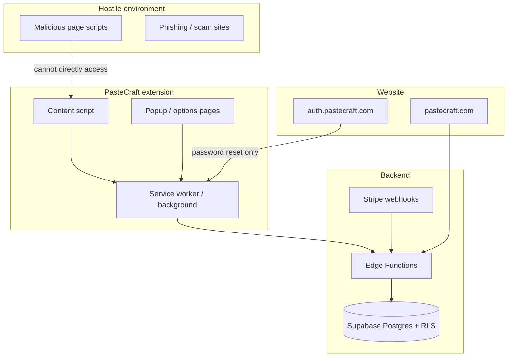
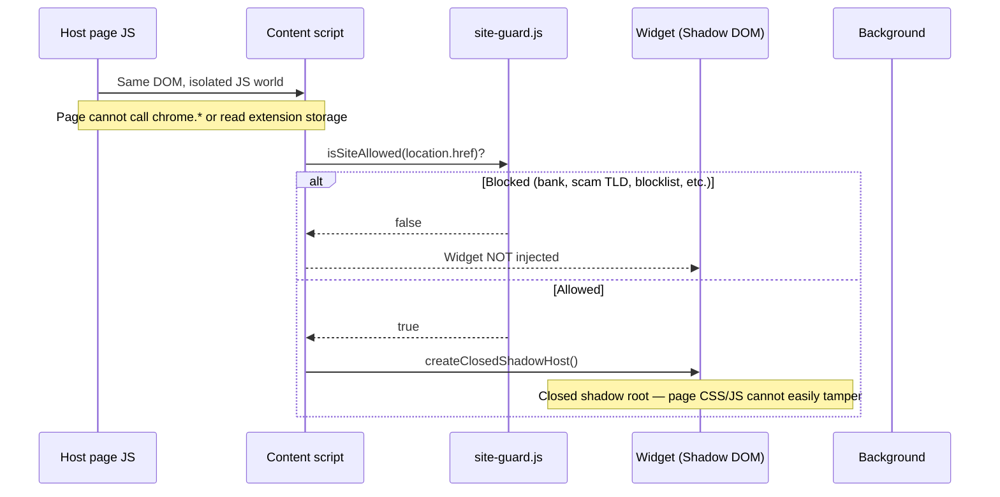
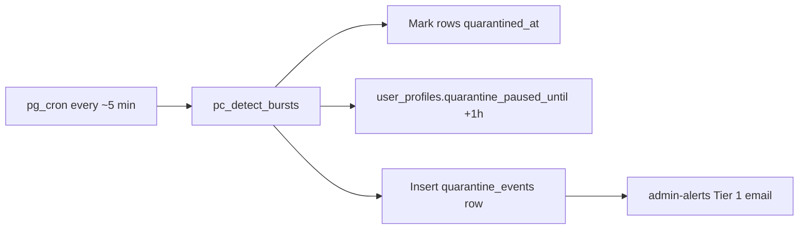
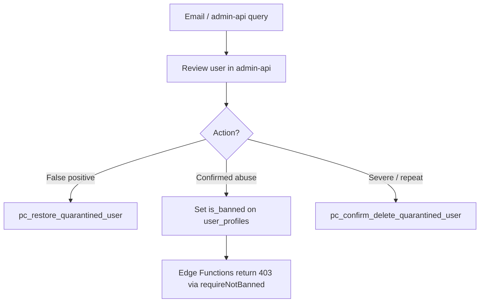
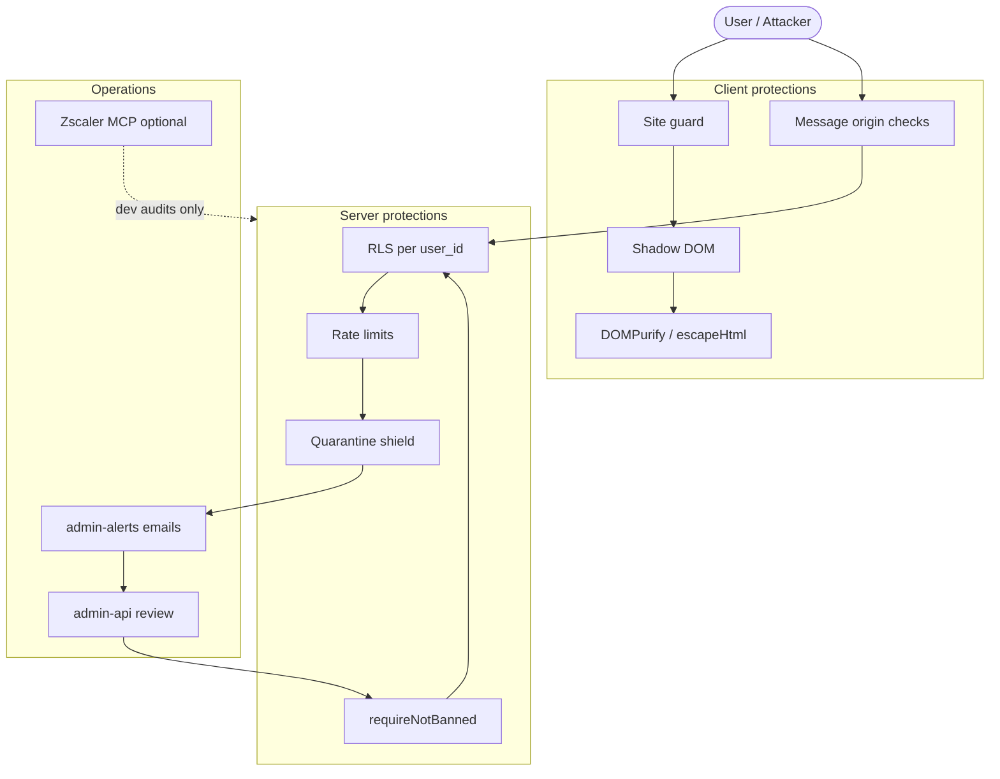

# PasteCraft Security Workflow — Educational Guide

This document explains **how PasteCraft security actually works**: what gets protected, what does not, how abuse is detected and blocked, and how admins are notified. It is written for product owners and developers who need a clear mental model—not a marketing overview.

---

## Table of contents

1. [The core mental model](#1-the-core-mental-model)
2. [Where attacks can happen (surfaces)](#2-where-attacks-can-happen-surfaces)
3. [Defense layers (stack overview)](#3-defense-layers-stack-overview)
4. [Workflow A — Malicious page scripts & clip XSS](#4-workflow-a--malicious-page-scripts--clip-xss)
5. [Workflow B — API abuse, spam, and account blocking](#5-workflow-b--api-abuse-spam-and-account-blocking)
6. [Workflow C — Admin detection and response](#6-workflow-c--admin-detection-and-response)
7. [Workflow D — Auth, payments, and privilege escalation](#7-workflow-d--auth-payments-and-privilege-escalation)
8. [Workflow E — AI features and prompt injection](#8-workflow-e--ai-features-and-prompt-injection)
9. [What is NOT in the product (common misconceptions)](#9-what-is-not-in-the-product-common-misconceptions)
10. [Optional ops layer — Zscaler MCP (developers only)](#10-optional-ops-layer--zscaler-mcp-developers-only)
11. [Priority roadmap (P0 / P1 / P2)](#11-priority-roadmap-p0--p1--p2)
12. [Glossary](#12-glossary)
13. [Quick reference — key files](#13-quick-reference--key-files)

---

## 1. The core mental model

PasteCraft is a **browser extension + Supabase backend + website**. Security is **layered**:

| Layer | Role |
|-------|------|
| **Browser platform** | Isolates extension code from hostile web pages |
| **Extension client** | Refuses dangerous pages, sanitizes HTML, validates messages |
| **Supabase (Postgres + RLS)** | Enforces per-user data access and DB triggers (rate limits, quarantine) |
| **Edge Functions** | JWT auth, ban checks, Stripe verification, fraud flags |
| **Admin automation** | Cron jobs + email alerts + admin API (not a user-facing “security bot”) |

**Important:** PasteCraft is **not** antivirus. It does **not** stop arbitrary JavaScript on a scam website from running. It **limits how much that page can affect PasteCraft** and **blocks abusive use of your backend**.

There is **no live “hacker detection agent”** inside the shipped extension watching every user in real time. Instead, the system uses **automated database rules + scheduled alerts + manual admin review**.

---

## 2. Where attacks can happen (surfaces)



| Surface | Examples of threats | Primary defenses |
|---------|---------------------|------------------|
| **Host web page** | Injected “nexus” scripts, page XSS, keyloggers | Chrome isolation; site-guard skips UI on risky URLs |
| **Extension UI** | Stored XSS in clip HTML, tampered messages | DOMPurify, `escapeHtml`, MV3 CSP, Shadow DOM |
| **Extension messaging** | Fake messages pretending to be the extension | `sender.id` checks, URL allowlists, external origin lock |
| **Supabase API** | Spam inserts, reading others’ data, tier tampering | RLS, rate-limit triggers, quarantine, ban gate |
| **Edge Functions** | Unauthenticated AI/checkout, coupon brute force | JWT, `requireNotBanned`, per-route limits |
| **Website** | Clickjacking, XSS on account pages | `_headers` CSP, HSTS, `X-Frame-Options` |

---

## 3. Defense layers (stack overview)

Think of security as **concentric rings**. An attacker must pass (or bypass) each ring to cause serious harm.

```
┌─────────────────────────────────────────────────────────────┐
│  Ring 5 — Ops / optional enterprise (Zscaler MCP, advisors) │
├─────────────────────────────────────────────────────────────┤
│  Ring 4 — Admin alerts + quarantine + manual ban            │
├─────────────────────────────────────────────────────────────┤
│  Ring 3 — Supabase RLS + DB triggers + Edge Function gates  │
├─────────────────────────────────────────────────────────────┤
│  Ring 2 — Extension messaging + auth bridge hardening       │
├─────────────────────────────────────────────────────────────┤
│  Ring 1 — Client: site-guard, Shadow DOM, DOMPurify, CSP    │
└─────────────────────────────────────────────────────────────┘
```

| Ring | What it stops | Where it lives |
|------|---------------|----------------|
| **1 — Client** | Rendering malicious HTML; injecting UI on scam/bank pages | `extension/content/safety/`, `markup-renderer.js`, `manifest.json` |
| **2 — Messaging** | Random websites sending commands to the extension | `background/handlers/messages-internal.js`, `messages-external.js` |
| **3 — Backend** | Cross-user data access, insert floods, banned users calling APIs | `db/migrations/*`, `supabase/functions/_shared/security-gate.ts` |
| **4 — Admin** | Silent abuse going unnoticed | `admin-alerts`, `quarantine_events`, `security_events`, `admin-api` |
| **5 — Ops** | Org-wide visibility (not end-user feature) | `docs/security/zscaler-mcp-setup.md`, `ArchiGuide/zscaler-security-architecture.md` |

---

## 4. Workflow A — Malicious page scripts & clip XSS

### Scenario: Someone runs a hostile script on a webpage

**What PasteCraft does *not* do:** Kill or block that script. Only the browser vendor and the site owner can do that.

**What PasteCraft *does* do:**



### Scenario: User saves clip HTML that contains `<script>` or event handlers

When clip markup is **rendered** (not when stored on the host page):

1. **`markup-renderer.js`** runs content through **DOMPurify** with an allowlist of tags/attributes.
2. If DOMPurify is unavailable, fallback **strips all tags** (text only).
3. Popup list/search UI uses **`escapeHtml`** so user text is not interpreted as HTML.

**Client files:**

| File | Purpose |
|------|---------|
| `extension/content/safety/site-guard.js` | Blocks widget on finance hosts, scam paths, punycode, risky TLDs, static blocklist |
| `extension/content/safety/shadow-host.js` | Closed Shadow DOM for injected UI |
| `extension/markup-renderer.js` | DOMPurify sanitization before render |
| `extension/manifest.json` | MV3 CSP: `script-src 'self'` on extension pages |

### Site-guard decision flow (simplified)

```
URL requested
    │
    ├─ chrome://, file://, javascript:, data:, blob:  → BLOCK
    ├─ Known banking / Stripe checkout hosts         → BLOCK (no clipboard UI on sensitive sites)
    ├─ Static phishing host blocklist                  → BLOCK
    ├─ Punycode homoglyph (xn--)                     → BLOCK
    ├─ Suspicious TLD (.zip, .click, .xyz, …)         → BLOCK
    ├─ Scam path keywords (seed-phrase, wallet-connect, …) → BLOCK
    └─ otherwise                                     → ALLOW (widget may load)
```

**Planned improvement:** Remote signed blocklist JSON from `pastecraft.com` (commented in `site-guard.js`, not fully wired yet).

---

## 5. Workflow B — API abuse, spam, and account blocking

This is how PasteCraft **blocks a user** who floods the system or violates policy—not via a live in-app agent, but via **database rules and Edge Function gates**.

### Layer 2 — Daily clip rate limit

```
User inserts clip
        │
        ▼
BEFORE INSERT trigger: check_clip_insert_limit()
        │
        ├─ user_profiles.is_banned = true  → RAISE EXCEPTION (blocked)
        ├─ clips today >= daily_clip_limit (default 700)  → RAISE EXCEPTION
        └─ OK  → INSERT proceeds
        │
        ▼
Violation logged → rate_limit_violations (admin-only table)
```

**Migration:** `db/migrations/20260408_clip_rate_limit.sql`

### Layer 3 — Burst quarantine shield

If someone slips past daily limits with a **burst flood** (many inserts in a short window):



**What quarantine means:**

- Affected rows hidden from user via RLS (`quarantined_at IS NOT NULL`).
- User may be paused from syncing/writing for ~1 hour.
- Admin can **restore** or **confirm delete** via `admin-api` RPCs.
- Rows auto-purged after 48h if not restored.

**Migration:** `db/migrations/20260417_phase3_quarantine_shield.sql`

### Manual / automated ban gate

When an admin bans a user (or automation sets `is_banned`):

```
Edge Function request (AI, checkout, coupon, …)
        │
        ▼
requireNotBanned(userId, supabase)   ← supabase/functions/_shared/security-gate.ts
        │
        ├─ is_banned + not expired  → HTTP 403 "Account suspended"
        ├─ ban_expires_at passed    → auto-lift ban, allow
        └─ not banned               → continue
```

**Also at DB level:** RLS helper `user_is_not_banned()` (see `db/migrations/20260521_fix_sync_rls_grants.sql`).

### Other abuse paths

| Abuse type | Detection | Response |
|------------|-----------|----------|
| Coupon brute force | >5 attempts/hour in `redeem-coupon` | 429 + block |
| Checkout spam | >10 sessions/hour in `create-checkout` | `security_events` row + 429 |
| Subscription tampering | Client UPDATE on `user_subscriptions` | RLS blocks; Stripe webhook is source of truth |

---

## 6. Workflow C — Admin detection and response

There is **no** user-visible “security agent.” Admins rely on **logged events + email digests**.

### Data tables (audit trail)

| Table | What gets recorded |
|-------|-------------------|
| `quarantine_events` | Burst quarantine actions (user, table, row count, reason) |
| `rate_limit_violations` | Daily limit hits |
| `security_events` | Checkout fraud flags, admin security actions, etc. |
| `admin_users` | Who may call `admin-api` |

### Alert tiers (`admin-alerts` Edge Function)

Called on a schedule (pg_cron, ~every 10 minutes). Authenticated with `ADMIN_ALERTS_CRON_SECRET` or service role.

| Tier | When | What you get |
|------|------|--------------|
| **T1 — Immediate** | New `quarantine_events` row | One email per quarantine |
| **T2 — Hourly digest** | User crosses rate-violation or security-event thresholds in 60 min | One digest email (60-min cooldown) |
| **T3 — Daily rollup** | Once per day (~09:00 CST window) | Summary counts for last 24h |

**File:** `supabase/functions/admin-alerts/index.ts`

### Admin response workflow (human in the loop)



**Note:** Full admin **dashboard UI** (feature #42 in `instructions/request.md`) is still planned; **`admin-api` backend exists** today with localhost-focused CORS.

---

## 7. Workflow D — Auth, payments, and privilege escalation

### Session storage

- Supabase session lives in **`chrome.storage.local`**, not page `localStorage`.
- Content scripts cannot call `chrome.identity` or open arbitrary tabs—they message the service worker.

### External auth bridge (password reset only)

Only **`https://auth.pastecraft.com`** may send external messages (`manifest.json` → `externally_connectable`).

```
auth.pastecraft.com sends password_reset message
        │
        ├─ sender origin !== auth.pastecraft.com  → reject
        ├─ payload fails schema / size checks     → reject
        ├─ state !== one-time value in storage    → reject (replay protection)
        └─ OK → store tokens for reset UI, consume state
```

**File:** `extension/background/handlers/messages-external.js`

### Internal messages

Every internal message:

```
sender.id === chrome.runtime.id  → else reject invalid_sender
Sensitive actions (token refresh, open popup URL) → extension-page or URL allowlist checks
```

**File:** `extension/background/handlers/messages-internal.js`

### Row Level Security (RLS)

Every user-owned row is scoped with **`auth.uid()::text = user_id`**. This is the backbone of cross-device sync security.

**Schema reference:** `db/supabase-schema.sql`

**Critical ops task:** Periodically run Supabase Security Advisor and confirm no `USING (true)` “allow all” policies remain in **production** (historical issue documented in `docs/supabase/SUPABASEcsReport.md`, fixes tracked in `db/vulnerabilityfixes.md`).

### Stripe

- Checkout sessions created only after JWT + ban check.
- **`stripe-webhook`** verifies `Stripe-Signature` before updating subscription state.
- Clients cannot self-upgrade tier via direct DB UPDATE (hardened RLS on `user_subscriptions`).

---

## 8. Workflow E — AI features and prompt injection

AI routes (`ai-refactor`, `ai-image`, `ai-lab`, etc.) use shared workflow in `supabase/functions/_shared/ai_workflow.ts`:

```
Request arrives
    │
    ├─ requireAuthenticatedUser (JWT)
    ├─ requireNotBanned
    ├─ Premium / credit checks
    ├─ Input truncated (e.g. ~500 char slices before LLM)
    └─ Forward to provider (OpenAI, Replicate, …)
```

**What exists today:** Auth, ban gate, credits, truncation, structured system prompts.

**What does NOT exist yet (gaps):**

- Dedicated prompt-injection classifier
- Automatic secret/PII scrubbing before LLM calls
- Output toxicity/filter pipeline in code
- Zscaler AI Guard (documented as **target architecture** only — see `ArchiGuide/zscaler-security-architecture.md`)

**Recommended future workflow:**

```
User clip text → regex/entropy scan for secrets → strip or block → log security_events if violation → then LLM
```

---

## 9. What is NOT in the product (common misconceptions)

| Expectation | Reality |
|-------------|---------|
| “PasteCraft blocks hacker scripts on any website” | **No.** Site-guard only **refuses to inject** PasteCraft UI on risky pages. |
| “There’s a live AI agent watching for attacks” | **No.** Batch cron emails + DB automation + admin review. |
| “Zscaler protects every user’s browser” | **No.** Zscaler MCP is **optional dev tooling in Cursor** for your org—not shipped in the extension. |
| “Sanitized clips make the host page safe” | **No.** Sanitization protects **PasteCraft’s own render paths**, not the host site DOM. |
| “Rate limits stop all spam tables equally” | **Partial.** Clips have strong triggers; notes/categories may need the same pattern (see roadmap). |

---

## 10. Optional ops layer — Zscaler MCP (developers only)

This layer protects **your development and corporate network posture**, not end users directly.

```
Cursor agent → zscaler-mcp (read-only) → ZTE APIs (ZIA, ZDX, EASM, Z-Insights)
                      ↓
              Audit / investigate / list policies
                      ↓
              Human review → optional allowlisted write
```

**Setup:** `docs/security/zscaler-mcp-setup.md`  
**Architecture map:** `ArchiGuide/zscaler-security-architecture.md`

Use cases for you (not customers):

- EASM scan of `pastecraft.com` subdomains
- Verify ZIA allows Supabase, Stripe, Google OAuth
- Investigate Z-Insights incidents
- Plan AI Guard / DLP on dev-machine GenAI traffic

---

## 11. Priority roadmap (P0 / P1 / P2)

Use this when planning the next security sprint.

### P0 — Do first (production correctness)

1. **Verify production RLS** — Security Advisor clean; no permissive policies on `clips`, `categories`, `settings`, `user_profiles`.
2. **Confirm cron + secrets** — `admin-alerts` and quarantine cron running; `ADMIN_ALERTS_CRON_SECRET` set.
3. **Leaked password protection** — Enabled in Supabase Auth dashboard.
4. **Tighten DOMPurify** — Review allowing `style` / `id` in `markup-renderer.js`.
5. **Remote site-guard blocklist** — Ship updatable blocklist from `pastecraft.com`.

### P1 — Hardening

1. **AI input guardrails** — Secret/PII scrub + `security_events` logging in `ai_workflow.ts`.
2. **Extension quarantine awareness** — Honor `quarantine_paused_until` client-side during sync.
3. **Admin dashboard UI** — Wire feature #42 to existing `admin-api`.
4. **Site-wide website CSP** — Extend `website/public/_headers` beyond account/reset routes.
5. **Extend rate limits** — Same burst/daily patterns for notes, categories, archived clips.

### P2 — Ops & polish

1. **Operationalize Zscaler MCP** — Scheduled EASM / policy audits.
2. **Faster alerting** — Webhooks or Slack for high-severity `security_events` (today: hourly digest thresholds).
3. **Storage RLS audit** — Profile images bucket policies in prod.
4. **MV3 cleanup** — Replace inline `onclick` in widget iframe with `data-action` delegation.

---

## 12. Glossary

| Term | Meaning |
|------|---------|
| **RLS** | Row Level Security — Postgres policies restricting which rows each JWT can see/write |
| **Edge Function** | Supabase serverless HTTP handler (Deno) for AI, checkout, webhooks, admin |
| **Site guard** | Client module that decides whether PasteCraft UI may load on the current URL |
| **Quarantine** | Soft-delete + pause: rows marked `quarantined_at`, user temporarily blocked from normal sync |
| **Ban gate** | `requireNotBanned()` / `is_banned` checks before sensitive operations |
| **Shadow DOM** | Encapsulated DOM subtree; page scripts cannot easily read or modify extension UI inside a closed root |
| **DOMPurify** | Library that strips dangerous HTML before rendering user content |
| **MV3 CSP** | Manifest V3 Content Security Policy — blocks inline scripts in extension pages |
| **security_events** | Server-side audit log for fraud/abuse signals |
| **admin-alerts** | Scheduled email notifier—not a real-time IDS |

---

## 13. Quick reference — key files

| Area | Path |
|------|------|
| Site guard | `extension/content/safety/site-guard.js` |
| Shadow DOM | `extension/content/safety/shadow-host.js` |
| HTML sanitization | `extension/markup-renderer.js` |
| Extension CSP | `extension/manifest.json` |
| Internal messages | `extension/background/handlers/messages-internal.js` |
| External auth bridge | `extension/background/handlers/messages-external.js` |
| Ban gate | `supabase/functions/_shared/security-gate.ts` |
| AI workflow gates | `supabase/functions/_shared/ai_workflow.ts` |
| Admin alerts cron | `supabase/functions/admin-alerts/index.ts` |
| Admin API | `supabase/functions/admin-api/index.ts` |
| Clip rate limit | `db/migrations/20260408_clip_rate_limit.sql` |
| Quarantine shield | `db/migrations/20260417_phase3_quarantine_shield.sql` |
| Website headers | `website/public/_headers` |
| Vulnerability tracker | `db/vulnerabilityfixes.md` |
| Zscaler setup | `docs/security/zscaler-mcp-setup.md` |
| Zscaler architecture | `ArchiGuide/zscaler-security-architecture.md` |

---

## Summary diagram — end-to-end security story



---

*Last updated: May 2026 — aligns with extension manifest 3.0.x and May 2026 security hardening pass documented in `implementations.md`.*
